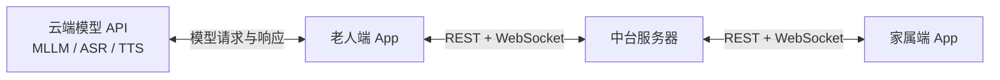
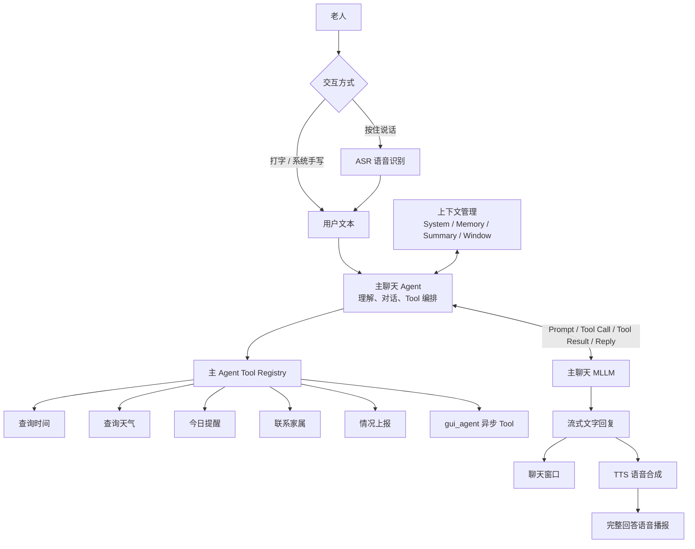
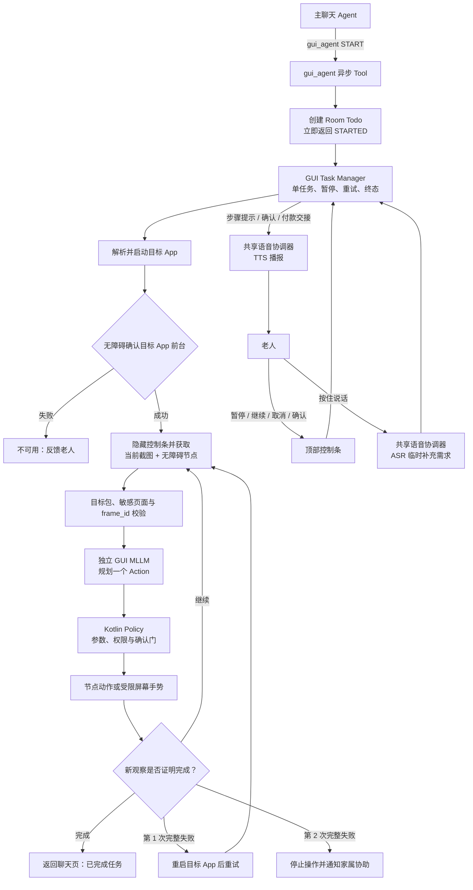
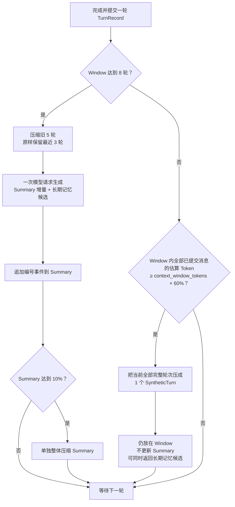

# SilverAgeAssistant（银龄助手）

银龄助手是一套面向老年人与家属的 Android AI Agent 应用。项目希望通过适老化界面、自然语言和语音交互、家庭协同、可靠提醒以及受控的手机自动操作，降低老人使用智能手机和线上服务的门槛。

同一个 APK 同时包含老人模式和家属模式：老人端负责日常交互、端侧 Agent 编排和本地数据管理；家属端负责远程提醒、状态查看与非敏感配置；FastAPI 中台负责身份绑定和跨端业务同步。日常 MLLM、ASR 与 TTS 请求由老人设备直接访问用户配置的模型服务，中台不代理模型流量，也不保存模型 API Key。

> 当前项目是持续开发中的功能原型，不是医疗器械，也不能替代医生、护理人员或急救服务。文档中会明确区分“已实现”和“设计预留”，规划能力不代表当前 APK 已经可用。
>
> 安卓安装包下载地址：[魔塔社区 SilverAgeAssistant](https://modelscope.cn/models/Acede1/SilverAgeAssistant)

## 1. 核心功能

### 1.1 老人模式

- **适老化首页**：大字号、大触控区、固定入口和简短明确的状态反馈；
- **和我说话**：支持打字、系统手写输入、按住说话、流式文字回复及完整回答 TTS 播报；
- **今日提醒**：接收家属提醒并可靠写入 Room，按时间和完成状态排序，截止后每小时本地催办；
- **家庭联系**：同步已绑定家属资料，手机号加密保存在本机，拨号前由老人确认；
- **天气与新闻**：根据设备位置显示真实城市、实时天气和未来三天预报；展示百度热搜并播报前五条；
- **本地长期记忆**：保存老人称呼、家庭关系和经过确认的稳定偏好，为聊天提供长期上下文；
- **Agent Tools**：支持查询时间、查询天气、今日提醒、联系家属、报告情况和启动 GUI Agent；
- **GUI Agent 实验能力**：通过 Android 无障碍节点与截图辅助操作受支持的第三方 App；
- **异常状态监控实验链路**：按家属配置分析测试图像，连续异常后通知家属、发送短信并上传单张证据图供人工核实。

### 1.2 家属模式

- 家属注册、老人档案创建、绑定码生成与更新、老人设备绑定和重新绑定；
- 向老人发送即时通知和一次性提醒；
- 查看提醒接收状态、老人完成确认和提醒记录；
- 查看老人主动报告的今日状态、紧急事件及有限证据图像；
- 清除已处理的提醒记录和紧急事件；
- 下发非敏感的文字模型、语音模型和上下文配置；
- 远程调整或关闭老人异常状态检测；
- 查看老人设备的今日用量及月度 Token、ASR、TTS 趋势。

### 1.3 家庭协同闭环

通知与提醒在产品语义上保持区分：

- **通知**用于向老人传递信息，收到后进入今日提醒展示，但不要求老人回传完成状态；
- **提醒**具有截止时间，老人明确点击完成后才通过中台回传，家属可查看已完成或未完成；
- **紧急事件**用于身体不适、连续异常检测或 GUI Agent 多次失败后的家属协助请求；
- WebSocket 只负责在线提示，客户端仍通过 REST 获取完整数据并写入本地事实来源，断线后可以补拉恢复。

## 2. 项目亮点

- **一个 APK、双角色协同**：老人和家属使用独立导航与权限边界，同时复用统一的数据层和通信层。
- **模型直连、家庭协同解耦**：模型请求从老人设备直达模型 Provider，中台只处理可靠的跨端业务数据。
- **本地优先与离线可用**：提醒、联系人快照、长期记忆和密钥优先保存在老人设备，已保存提醒在断网时仍可触发。
- **多 Agent 隔离**：主聊天 Agent、GUI Agent 和状态监控 Agent 使用不同提示词、上下文和执行策略，避免无关信息互相污染。
- **模型建议、代码执行**：模型只能返回 Tool Call 或 GUI Action；权限、手机号、提醒状态、事件级别和敏感页面由 Kotlin 确定性控制层处理。
- **受控 GUI 自动化**：每次动作前重新观察页面，优先使用无障碍节点，必要时才使用截图坐标；订单提交、付款和凭证页面设有明确安全门。
- **可靠跨端通信**：重要请求使用稳定业务 ID 或幂等键，先写数据库再发送 WebSocket 提示，Android 落库成功后才 ACK。
- **隐私最小化**：API Key、完整手机号、长期记忆、完整聊天和原始音频默认不进入中台；音频仅在内存中处理。
- **失败可恢复、可求助**：网络、权限和模型错误使用老人可理解的反馈；GUI Agent 连续两次完整运行失败后可转交家属协助。
- **全局用量管理**：统一统计 MLLM 输入/输出 Token 及 ASR、TTS 调用次数，为上下文压缩和家庭用量观察提供依据。

## 3. 整体系统架构



系统只保留两条主链路：老人端直连模型 API 完成推理，老人端与家属端通过中台交换绑定、提醒、配置、用量和紧急事件。模型 API 与中台之间没有转发关系，家属端也不直接访问老人的模型服务。

### 3.1 Android 分层

```text
Jetpack Compose UI
        ↓ UI events / immutable state
ViewModel + StateFlow + Coroutines
        ↓ use cases
Domain
├── 主聊天 Agent / GUI Agent / 状态监控 Agent
├── 提醒与紧急事件策略
└── 家庭通信与用量管理
        ↓ interfaces
Data & Platform
├── Room / DataStore / Android Keystore
├── HTTP / SSE / WebSocket
├── AudioRecord / AudioTrack / AudioFocus
├── WorkManager / foreground service / notifications
└── Location / Phone / SMS / AccessibilityService
```

Composable 只渲染状态并发送事件，网络、数据库、播放器、录音器和系统能力均位于可替换接口之后。提醒以老人端 Room 为本地事实来源；敏感配置使用 Android Keystore 生成的 AES-GCM 密钥加密保存。

### 3.2 FastAPI 中台分层

```text
REST routers / WebSocket endpoints
                ↓
Application services
                ↓
Repositories and delivery
                ↓
SQLite / in-process connection state
```

中台采用 Python、FastAPI、Pydantic、SQLAlchemy Async、Alembic 和 SQLite：

- REST 负责可靠提交、查询、补拉和 ACK；
- WebSocket 负责连接存活期间的低延迟提示，不是业务事实来源；
- 正式业务记录写入 SQLite，在线连接映射只保存在进程内存；
- 中台不代理老人端日常模型请求，不保存模型 API Key、完整聊天或原始录音；
- 当前轻量版本按单进程运行，未来需要多实例时再评估独立数据库和共享缓存。

## 4. Agent 系统架构

银龄助手当前采用“主聊天 Agent 负责理解与协调、GUI Agent 负责受控操作、Android 控制层负责授权和执行”的结构。独立状态监控 Agent 与聊天链路隔离，只复用模型配置、用量记录和确定性通知能力。下面分别展示主 Agent、GUI Agent 和上下文系统，避免把不同职责压在一张图中。

### 4.1 主聊天 Agent



主聊天 Agent 由端侧协调器组装 System Prompt、启动时长期记忆快照、Summary、Window Context、当前输入和 Tool Definitions。明确的 GUI 操作与今日提醒查询可先经过 Kotlin 确定性路由；其他请求进入“模型 → Tool → Tool Result → 模型”的标准循环。

当前注册的主 Agent Tools：

| Tool | 作用 | 关键边界 |
|---|---|---|
| `get_current_time` | 查询设备本地日期、时间和时区 | 时间不由模型猜测 |
| `get_weather` | 查询实时天气和未来三天预报 | 经纬度不进入模型上下文 |
| `list_today_reminders` | 读取本地提醒状态 | 只读，不能代替老人确认完成 |
| `call_family_contact` | 联系已绑定家属 | 手机号仅在端侧解析，拨号前确认 |
| `report_family_situation` | 上报一般或紧急事件 | 时间、级别和幂等 ID 由端侧确定 |
| `gui_agent` | 启动或控制异步 GUI 任务 | `STARTED` 只代表任务已创建 |

每轮主 Agent 最多进行三次模型/Tool 递归。只有 Tool 明确返回成功后，Agent 才能声称操作成功；Registry 不存在、参数错误、权限不足或执行失败时必须如实反馈。

### 4.2 GUI Agent

GUI Agent 是主 Agent 可调用的异步工具，但拥有独立的 System Prompt、视觉模型上下文、Tool Registry、任务状态和用量标签。它不读取主 Agent 的完整对话或长期记忆。



当前执行链路为：

1. 主 Agent 创建 GUI Todo，并立即返回“已经开始处理”；
2. Task Manager 解析并启动受支持的目标 App；
3. 无障碍服务确认目标 App 已进入前台；
4. 非纯打开任务循环获取当前截图和无障碍节点；
5. GUI MLLM 每次只规划一个受协议限制的动作；
6. Kotlin 控制层校验 `frame_id`、目标、参数、权限和敏感页面；
7. 执行动作后重新截图验证页面变化；
8. 第一次完整运行失败时自动重新开始，第二次失败时停止并尝试通知家属协助。

GUI Planner 当前支持点击节点、点击截图坐标、输入普通文本、滚动、返回、等待、询问老人、付款交接、调用允许的共享工具、完成和失败等动作。默认优先使用无障碍节点；模型坐标仅对应当前上传截图，旧帧、旧节点和旧坐标不能复用。

复杂任务的 **Planned Mode**、任务复杂度路由和高层目标状态计划已经完成设计，但当前尚未编码。现有非纯打开任务仍使用单步 Direct ReAct，不应把 Planned Mode 描述为已实现能力。

### 4.3 上下文压缩与长期记忆

主 Agent 实际发送给模型的 Prompt 由六部分组成：

```text
Prompt Tokens
= System Prompt
+ Startup MEMORY.md Snapshot
+ Summary
+ Window Context
+ Current User Input
+ Tool Definitions
```

其中 System Prompt 与启动时的 Memory 快照构成稳定前缀，Summary 保存被压缩的较早历史，Window 保存最近的完整对话轮次。当前用户输入和 Tool Definitions 每次请求按实际状态追加。发送前必须满足硬限制：

```text
estimated_prompt_tokens + max_output_tokens <= context_window_tokens
```

`max_output_tokens` 是为模型回答保留的预算，不是已经放入 Prompt 的消息。模型窗口采用以下管理目标：

| 区域 | 目标占比 | 处理方式 |
|---|---:|---|
| System Prompt + 启动 Memory 快照 | 20% | 稳定前缀，不截断、不压缩 |
| Summary | 10% | 达到限额后单独整体语义压缩 |
| Window Context | 60% | Window 内全部已提交消息 Token 的压缩触发阈值 |
| 安全预留 | 10% | 当前输入、Tool Schema、模型输出和估算误差 |

这些比例是管理目标，而不是把完整 Prompt 按字符强行切成四段。即使稳定前缀超过目标比例，System Prompt 和启动 Memory 快照仍保持完整；当前允许执行语义压缩的区域只有 Summary 和 Window。

#### 对话轮次与压缩

一个 `TurnRecord` 从用户输入开始，以最终 Assistant 回复结束，中间可以包含多次 Assistant Tool Call 和对应 Tool Result。一次 Tool Call 不能被拆成单独轮次。上下文压缩直接采用 Agent 设计文档中的流程：



图中的 60% 判断只统计 Window 内已经提交的完整消息，不是“对话轮数达到六成”，也不是“整个 Prompt 使用率达到六成”。设模型上下文容量为 `C`，Window 内所有 `TurnRecord.messages` 的估算 Token 总数为 `W`，则提前压缩条件为：

```text
turn_count < 8  且  W >= floor(C × 0.60)
```

具体规则如下：

- `W` 包含 Window 中的 User、Assistant、Tool Call 和成对的 Tool Result，不包含 System Prompt、启动 Memory 快照、Summary、Tool Definitions、Usage 或输出预留；
- 达到八轮时优先执行“压缩旧五轮、保留最近三轮”，不会再走 60% 的整窗压缩分支；
- 轮数不足八轮但 `W` 达到 60% 时，当前全部完整轮次压缩为一个 `SyntheticTurn`，它继续留在 Window，不更新 Summary；
- 八轮压缩使用一次模型请求同时产生 Summary 增量和长期记忆候选；Summary 达到 10% 后再单独整体压缩；
- 端侧估算器对非 ASCII 字符按约 1 Token、ASCII 字符按约 0.25 Token 估算，每条消息额外计 4 Token，每个 Tool Call 或 Tool Definition 额外计 8 Token；该数值只用于稳定触发预算策略，不等于具体模型 Tokenizer 的精确结果；
- 压缩在完整轮次提交后异步进行，下一次请求会等待未完成的压缩，避免上下文状态竞争；压缩失败时原 Summary、Window 和 Memory 保持不变；
- 每次模型调用的输入、输出 Token 单独进入全局用量统计，但 Usage 不序列化到聊天上下文。

聊天页右上角的圆形进度显示当前实际组装上下文的 `usedTokens / context_window_tokens`。它包含当时使用的 System/Memory、Summary、Window、当前输入和 Tool Definitions，但不包含为输出保留的 `max_output_tokens`，也不能理解为单独的 Window 使用率。

#### 长期记忆生命周期

长期记忆保存在老人设备应用私有目录的 `files/agent/MEMORY.md`，包含老人基本信息、已绑定家属摘要和经过确认的长期事实。完整手机号仍只保存在 Keystore 加密联系人快照中，不写入 Memory。

主 Agent 在 Android 进程冷启动时完整读取一次 `MEMORY.md` 并形成不可变快照。同一进程内页面切换、Activity 重组或重新进入聊天页都不会重新读取。会话期间写入的新事实要到下一次进程冷启动才进入模型 Prompt，以保持稳定前缀和缓存命中。

长期记忆有两类写入来源：

- 绑定和联系人同步等确定性业务流程负责更新老人、家属受控区段；
- 滑动窗口或整窗压缩负责提取老人明确表达、稳定且有意义的事实。

模型产生的候选必须同时包含 `fact` 和能够在待压缩用户原话中找到的 `evidence`。端侧检查证据、敏感信息、重复内容和长度后，只持久化 `fact`，不保存 `evidence`。当前限制为单条最长 300 字、最多 100 条、文件总大小不超过 24,000 字节，并使用临时文件替换降低写入中断风险。API Key、完整手机号、验证码和支付信息不得进入长期记忆。

### 4.4 安全控制

- 模型负责提出 Tool Call 或 Action，Kotlin 状态机负责授权与实际执行；
- GUI 每次只执行一个动作，动作成功不等于业务任务完成，必须从新观察中获得完成证据；
- 暂停、取消、人工接管和敏感页面拦截优先于模型动作；
- 提交订单前必须获得老人确认；支付密码、银行卡密码、验证码和生物识别永远交由老人本人完成；
- GUI 截图、节点、坐标和步骤历史只存在于当前运行过程，不写入长期记忆或中台；
- 连续失败后的家属上报由确定性任务状态机触发，模型不能伪造或抑制。

## 5. 测试模型

项目开发与功能验证过程中使用过以下模型。它们是测试配置，不代表项目只能使用这些模型，也不表示仓库内置相应服务、地址或凭证。

| 类型 | 测试模型 | 用途 |
|---|---|---|
| 多模态大模型 | `qwen3.7-plus`、`qwen3.8-max` | 主聊天、Tool Use、多模态能力及云端模型兼容性测试，开发过程中均有使用 |
| GUI 多模态模型 | `Tongyi-MAI/MAI-UI-8B` | 本地部署的 GUI 页面理解与动作规划测试 |
| TTS | `qwen-audio-3.0-tts-flash` | 聊天回答、新闻及必要状态的语音播报 |
| ASR | `qwen-audio-3.0-asr-flash-streaming` | 聊天与 GUI 任务中的流式语音识别 |

文字与多模态模型优先通过 OpenAI-compatible 协议接入，既可连接兼容的云端服务，也可用于本地模型服务测试。ASR 与 TTS 通过独立 Provider 和 WebSocket 协议封装，两者共用的 API Key 只保存在老人设备本地。

## 6. 技术栈

| 模块 | 技术方案 |
|---|---|
| Android UI | Kotlin、Jetpack Compose、Material 3、Navigation |
| 状态与并发 | ViewModel、StateFlow、Coroutines |
| 本地数据 | Room、Preferences DataStore |
| 密钥保护 | Android Keystore、AES-GCM |
| 调度与通知 | WorkManager、Foreground Service、Android Notifications |
| 网络与流式通信 | OkHttp、HTTP/SSE、WebSocket、kotlinx.serialization |
| 语音 | AudioRecord、AudioTrack、AudioFocus、可替换 ASR/TTS Provider |
| 系统能力 | Location、ACTION_DIAL、SMS、AccessibilityService |
| 模型协议 | OpenAI-compatible Chat/MLLM、llama-server 兼容接入 |
| 中台 | Python、FastAPI、Pydantic、SQLAlchemy Async、Alembic |
| 数据库 | SQLite、aiosqlite |
| 测试与质量 | JUnit、Compose UI Test、pytest、Ruff、mypy、OpenAPI 检查 |

Android 最低支持 Android 10（API 29）。GUI 截图当前依赖 Android 11（API 30）及以上的无障碍截图能力，Android 10 的兼容截图路径仍待补齐。

## 7. 仓库结构

```text
SilverAgeAssistant/
├── AndroidAgent/      Android 客户端、端侧 Agent 与系统能力
├── MiddleServer/      FastAPI 中台、数据库迁移、接口与测试
├── docs/              产品、架构、Android、Agent、接口、安全与路线图
├── scripts/           仓库检查和开发辅助脚本
└── README.md          项目总览与入口
```

## 8. 当前进度

### 已形成主要代码闭环

- 单 APK 双角色、注册绑定、重新绑定、凭证加密和会话恢复；
- OpenAI 兼容流式聊天、上下文预算、长期记忆快照和强类型 Tools；
- ASR/TTS、内存录音、播放仲裁和老人端全局语音开关；
- 家属通知、提醒落库、截止后催办、完成回传和家属记录；
- 天气、城市解析、新闻、联系人、模型配置热更新和全局用量；
- 家庭状态、紧急事件、证据图像查看与清除；
- GUI Agent 的无障碍观察、单步执行、控制门、失败重试和家属协助框架；
- 基于测试图像的状态监控、连续异常策略、短信和证据图像链路。

### 开发中或待验收

- GUI Agent Planned Mode 与真实外卖、网购 App 的有限白名单完整流程；
- Android 10 GUI 截图兼容、OCR 后备观察和进程退出后的任务恢复；
- 统一 Policy Engine、金额阈值和家属审批；
- 结构化记忆治理、跨会话聊天恢复和 RAG；
- 跨时区提醒、稍后提醒重调度、本地提醒 CRUD 和执行历史；
- 独立 SOS 本地兜底链路与真实局域网摄像头；
- CI、正式签名、发布配置、安全审计和多厂商真机验收。

## 9. 安全与隐私边界

- 模型 API Key 只能在老人设备本地加密保存，不上传中台、日志或 Git；
- 真实服务地址、本机路径、手机号、验证码、数据库密码和签名私钥不得写入公开文档或发布产物；
- 家属默认只能查看被授权的状态摘要，不能读取老人完整聊天；
- 音频只在内存中处理，不写入文件、Room 或中台；
- 天气经纬度只用于直接访问天气服务，不上传中台或交给模型；
- “已完成”只表示老人执行了确认动作，不证明事项在现实中客观完成；
- 异常状态检测只提供“疑似、需要核实”的辅助信息，不作医疗诊断；
- 当前独立 SOS 尚未完成，不能把本项目作为唯一紧急救援工具。

## 10. 开发与配置

建议使用 Android Studio 自带 JDK 和项目当前声明的 Android SDK，不需要在全局环境安装无关软件包。Android Debug 配置从 `AndroidAgent/dev.properties.example` 复制到被 Git 忽略的 `AndroidAgent/dev.properties` 后填写；中台配置使用本地环境变量或未入库配置文件。

仓库和 README 不提供真实服务地址、端口、API Key 或个人信息。开源 APK 应使用项目提供的脱敏构建参数生成，联网业务需由开发者在自己的环境中安全配置。

更详细的构建、中台启动、接口及测试方法请参阅对应专题文档，避免把本地私有配置复制到公开文档。

## 11. 文档入口

- [项目完整说明](docs/00-product/project-description.md)
- [产品总览](docs/00-product/product-overview.md)
- [需求与范围](docs/00-product/requirements-and-scope.md)
- [整体系统架构](docs/01-architecture/system-architecture.md)
- [架构决策](docs/01-architecture/architecture-decisions.md)
- [Android UI 与功能](docs/02-android/android-ui-and-features.md)
- [家属模式](docs/02-android/family-mode.md)
- [主聊天 Agent 与 GUI Agent 设计](docs/03-agent-system/main-and-gui-agent-design.md)
- [Agent Tools 与能力清单](docs/03-agent-system/agent-tools-and-capabilities.md)
- [上下文压缩设计](docs/03-agent-system/context-compression-design.md)
- [语音交互设计](docs/03-agent-system/voice-interaction-design.md)
- [模型接入](docs/03-agent-system/model-integration.md)
- [FastAPI 通信设计](docs/04-middle-server/fastapi-communication.md)
- [API 契约](docs/04-middle-server/api-contract.md)
- [数据安全与隐私](docs/05-security/data-security-and-privacy.md)
- [开发路线图](docs/08-roadmap/roadmap.md)
- [开发 TODO](docs/08-roadmap/todo.md)
- [完整文档索引](docs/README.md)

## 12. 开源与贡献

提交代码或文档前，请确认变更不包含真实 API Key、服务地址、手机号、绑定码、用户数据库、长期记忆、聊天记录、截图、音频、证书或签名文件。新增能力应同步更新相关设计和接口文档，并明确哪些部分已经实现、哪些仍需测试。

远程仓库：<https://github.com/Bytes-Lin/SilverAgeAssistant>
