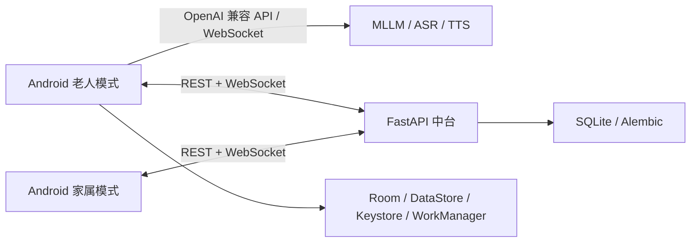

# Silver Age Assistant（银龄助手）

银龄助手是一套面向老年人及其家属的 Android AI 助手系统。项目通过适老化交互、语音对话、本地提醒、家庭协同和受控手机操作，降低老人使用智能手机和在线服务的门槛。

同一个 APK 同时提供老人模式与家属模式；老人设备直接调用用户配置的 MLLM、ASR 和 TTS 服务，FastAPI 中台只负责身份绑定、跨端通知、提醒、状态事件、配置和用量同步，不代理日常模型流量。

> 当前状态：功能原型持续开发中，尚未达到正式发布或医疗级产品标准。完整介绍见[项目完整说明](docs/00-product/project-description.md)，逐项进度见[开发路线图](docs/08-roadmap/roadmap.md)和[开发 TODO](docs/08-roadmap/todo.md)。

## 核心能力

### 老人模式

- 适老化首页：大字号、大触控区、固定四入口和简短状态反馈；
- AI 对话：打字、系统手写输入、按住说话、流式回答和完整回答 TTS 播报；
- 本地提醒：家属提醒可靠写入 Room，截止后每小时通知，完成后回传家属；
- 提醒自动收取：前台 WebSocket 提示、连接恢复和应用回前台时自动 REST 补拉，新提醒同时进入系统通知；
- 家庭联系：同步真实家属资料，本地加密保存手机号并进入系统拨号页；
- 生活信息：真实城市天气、未来三天预报、百度热搜前 15 条和前 5 条语音播报；
- Agent 能力：时间、天气、今日提醒、联系家属、情况上报和 GUI Agent 等强类型工具；
- Agent 能力边界：各 Agent 当前注册 Tool、GUI Action 和固定内部能力见[清单](docs/03-agent-system/agent-tools-and-capabilities.md)，规划项不计为可调用 Tool；
- GUI Agent 实验框架：基于 Accessibility 的截图、节点树、点击、输入和滚动，包含人工接管与敏感页面安全门；
- 状态监控实验链路：按家属配置分析 mock 图像，连续异常后通知、短信并上传单张证据图供家属核实。

### 家属模式

- 家属注册、老人档案、绑定码生成/更新和老人设备重新绑定；
- 向老人发送即时通知和一次性提醒；
- 查看提醒接收状态与老人完成确认；
- 提醒记录支持逐条清除 UI；中台账号级归档接口交付后可跨刷新持续隐藏；
- 查看老人主动上报的今日状态、紧急事件和证据图像，并清除已处理紧急事件；
- 下发非敏感模型与语音配置，远程调整或关闭状态检测；
- 查看老人设备上报的今日用量和月度 Token、ASR、TTS 趋势。

## 项目亮点

- **一个 APK，双角色协同**：共享数据与通信基础，同时保持老人和家属独立导航、权限与信息边界。
- **模型链路与家庭协同解耦**：实时 AI 流量从老人设备直达模型服务，中台不持有模型 API Key，也不会成为对话延迟和可用性的单点。
- **本地优先的提醒闭环**：Room 是老人提醒的事实来源，WorkManager 负责截止后重复通知，断网不影响已保存提醒。
- **语音全程内存处理**：录音 PCM 不落盘；ASR、MLLM、TTS 通过可替换 Provider 封装并统一记录用量。
- **可靠跨端通信**：重要数据先经 REST 写库，使用幂等键、ACK 和断线补拉；WebSocket 仅提供在线提示。
- **受控 Agent 执行**：模型只提出 Tool Call，电话号码、时间、事件级别和敏感页面规则由端侧确定性代码处理。
- **适老化失败反馈**：网络、权限、定位、录音和模型错误均使用老人可理解的提示，不展示异常栈或协程信息。
- **隐私最小化**：API Key、长期记忆、完整联系人和原始音频默认留在老人设备；家属无权查看完整聊天原文。

## 系统架构



架构遵循以下边界：

- Android 最低支持 Android 10（API 29）；
- 一个 APK 包含老人模式和家属模式；
- FastAPI 不代理日常 LLM、ASR 或 TTS 请求；
- REST 和 SQLite 是跨端业务事实来源，WebSocket 不作为唯一记录；
- 首版中台按单进程 + SQLite 设计，不引入 PostgreSQL 或 Redis；
- 不使用 FCM、EMAS 等第三方移动推送，App 被系统终止后不承诺即时送达。

详细设计见[系统架构](docs/01-architecture/system-architecture.md)和[架构决策](docs/01-architecture/architecture-decisions.md)。

## 技术栈

| 模块 | 技术方案 |
|---|---|
| Android | Kotlin、Jetpack Compose、Coroutines、ViewModel、Navigation |
| 端侧数据 | Room、Preferences DataStore、Android Keystore + AES-GCM |
| 后台与调度 | WorkManager、前台服务、Android 系统通知 |
| 网络与流式通信 | OkHttp、HTTP/SSE、WebSocket、JSON |
| 模型接入 | OpenAI 兼容 MLLM、llama-server、Qwen ASR/TTS Provider |
| 系统能力 | AudioRecord、AudioTrack、AudioFocus、定位、拨号、短信、AccessibilityService |
| 中台 | Python 3.12+、FastAPI、Pydantic v2、SQLAlchemy 2 async、Alembic、SQLite |
| 测试 | JUnit、Compose UI Test、pytest、Ruff、mypy、OpenAPI 检查 |

## 仓库结构

```text
SilverAgeAssistant/
├── AndroidAgent/      Kotlin、Compose、Room、端侧 Agent 与系统能力
├── MiddleServer/      FastAPI、SQLite、Alembic、REST/WebSocket 和测试
├── docs/              产品、架构、Android、Agent、接口、安全和路线图
├── scripts/           仓库检查和本地模型辅助脚本
├── AGENTS.md          开发边界和协作规则
└── README.md          项目入口
```

Android 和 MiddleServer 不维护独立 README，说明统一放在根 README 与 `docs/`。

## 快速开始

### 环境要求

- Android Studio，使用其自带 JDK；
- Android SDK，至少具备项目当前 compile/target SDK 和 API 29 测试环境；
- Python 3.12+；
- 可选：提供 OpenAI 兼容接口的 `llama-server` 或云端模型服务。

### 启动 FastAPI 中台

在 PowerShell 中执行：

```powershell
cd MiddleServer
py -3.12 -m venv .venv
.\.venv\Scripts\python.exe -m pip install -e ".[dev]"
.\.venv\Scripts\python.exe -m alembic upgrade head
.\.venv\Scripts\python.exe -m uvicorn app.main:app --host 0.0.0.0 --port 8765
```

开发数据库默认为 `MiddleServer/silverage.db`。本地开发可以使用默认密钥，非 development 环境必须通过 `SILVERAGE_` 环境变量提供真实安全配置，并在 TLS 反向代理后运行。完整配置见[FastAPI 通信设计](docs/04-middle-server/fastapi-communication.md)。

如需同时启用同一 FastAPI 应用内的本机用户管理页面，可改用：

```powershell
.\.venv\Scripts\python.exe -m app.admin_launcher --host 0.0.0.0 --port 8765
```

该命令同样提供老人端和家属端使用的 REST/WebSocket 业务接口，默认不打开浏览器。管理页面
只允许在服务器本机访问 `http://127.0.0.1:8765/admin`；Android 应连接实际可达的局域网
IP、公网 IP 或域名，不能连接 `0.0.0.0`。详细说明见
[中台用户管理后台](docs/04-middle-server/admin-user-management.md)。

### 配置并构建 Android

```powershell
cd AndroidAgent
Copy-Item dev.properties.example dev.properties
.\gradlew.bat assembleDebug
```

在 `dev.properties` 中按开发环境设置：

```properties
middleServerBaseUrl=http://<开发机地址>:8765
modelBaseUrl=http://<模型服务地址>:11435
chatModel=<模型名称>
# 正式体验测试使用 false；需要 GUI Agent 调试面板和追踪时改为 true。
guiDebugEnabled=false
```

`dev.properties`、`local.properties`、真实 API Key、数据库密钥和签名文件不得提交。也可以直接用 Android Studio 打开 `AndroidAgent/`，使用本机已有 SDK 构建和运行。

`guiDebugEnabled` 是构建级全局开关。Debug APK 默认 `false`：不显示应用内“GUI 调试”，
不显示跨 App 控制条的调试摘要，也不采集 GUI 调试事件，并固定使用节点优先混合定位。
需要排查 GUI Agent 时设为 `true` 后重新构建；Release APK 始终强制为 `false`，不能被本机
配置打开。该开关只控制调试能力，不会关闭 GUI Agent、任务控制条或面向老人的正常状态提示。

## 当前进度与限制

已形成主要代码闭环的能力包括：双端注册绑定、会话恢复、流式聊天、Qwen ASR/TTS、本地提醒及完成回传、天气、新闻、联系人、模型配置、全局用量、家庭事件、GUI Agent 核心框架和 mock 图像状态监控。

仍需重点完成：

- 老人设备时区同步及跨时区提醒；
- 真正的“稍后提醒”、本地提醒 CRUD、重复规则和执行历史；
- 家属提醒记录账号级归档接口；Android 清除按钮和请求映射已经完成；
- GUI Agent 在真实外卖/网购 App 中可重复成功的有限白名单流程；
- 通用 Policy Engine、金额阈值与家属审批；
- API 29 GUI 截图兼容、OCR 后备观察和可恢复任务；
- 结构化记忆治理、跨会话聊天恢复和 RAG；
- 独立 SOS 本地兜底链路与真实局域网摄像头；
- CI、正式签名、发布环境和多厂商真机验收。

## 安全与产品边界

- 本项目不提供医疗诊断、药物剂量建议或医疗级跌倒检测；
- “已完成”只代表老人执行了确认动作，不证明事项客观完成；
- Agent 不读取、保存或填写支付密码、短信验证码和生物识别信息；
- 支付或系统认证页面必须停止自动化并交还老人；
- 状态监控只允许上传达到阈值的一张短期证据图，不上传连续视频；
- 独立 SOS 尚未完成，当前版本不能作为唯一紧急救援工具；
- 模型用量为客户端统计或估算，不是云厂商正式账单。

详见[数据安全与隐私](docs/05-security/data-security-and-privacy.md)。

## 文档入口

- [项目完整说明](docs/00-product/project-description.md)
- [产品总览](docs/00-product/product-overview.md)
- [系统架构](docs/01-architecture/system-architecture.md)
- [Android UI 与功能](docs/02-android/android-ui-and-features.md)
- [家属模式](docs/02-android/family-mode.md)
- [Agent 系统开发进度](docs/03-agent-system/agent-development-status-2026-08-11.md)
- [Agent Tools 与能力清单](docs/03-agent-system/agent-tools-and-capabilities.md)
- [FastAPI 接口契约](docs/04-middle-server/api-contract.md)
- [非 Agent 功能开发进度](docs/06-development/non-agent-progress-2026-08-12.md)
- [开发路线图](docs/08-roadmap/roadmap.md)
- [完整文档索引](docs/README.md)

## 开发协作

开始开发前请阅读 [AGENTS.md](AGENTS.md) 和 [CONTRIBUTING.md](CONTRIBUTING.md)，再根据任务打开对应专题文档。功能修改必须同步更新文档，并明确已运行测试与仍未验证的风险。

远程仓库：<https://github.com/Bytes-Lin/SilverAgeAssistant>
