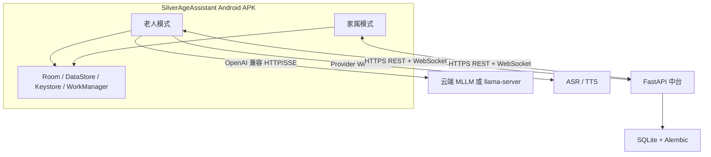

# 银龄助手项目完整说明

> 文档版本：2026-08-12（按当前代码复核）
> 项目阶段：持续开发中的功能原型
> 代码仓库：<https://github.com/Bytes-Lin/SilverAgeAssistant>

## 1. 产品简介

银龄助手（Silver Age Assistant）是一套面向老年人及其家属的 Android AI 助手系统。它希望把自然语言、适老化界面、手机系统能力和家庭协同结合起来，让老人能够更容易地聊天、获取生活信息、处理提醒、联系家人，并在需要时获得远程协助。

产品不是单纯的聊天机器人。它由老人设备上的 AI Agent、老人/家属双角色 Android 客户端，以及负责家庭协同的 FastAPI 中台共同组成：

- 老人通过语音、打字或系统手写输入表达目标；
- MLLM 负责理解意图、生成回答或提出 Tool Call；
- Android 端的确定性代码读取本地数据、调用系统能力并执行安全检查；
- 家属通过同一 APK 的家属模式完成配置、提醒、状态查看和异常处理；
- 中台可靠保存跨端业务数据，但不代理老人日常模型请求。

主要服务对象包括独居老人、不熟悉复杂智能手机操作的老人、需要日常事务提醒的老人，以及希望在尊重隐私的前提下提供远程协助的家属。

## 2. 产品目标与非目标

### 2.1 产品目标

1. **降低操作门槛**：用简短自然语言代替多层菜单和复杂表单。
2. **提供稳定陪伴**：支持自然聊天、称呼和家庭关系记忆、语音播报与明确状态反馈。
3. **改善日常执行**：通过天气、新闻、提醒和家庭通知帮助老人安排生活。
4. **加强家庭协同**：让家属能够下发提醒、查看确认结果、掌握授权范围内的状态摘要。
5. **建立受控执行基础**：让 Agent 可以调用手机能力，但必须经过确定性策略、老人确认和敏感页面拦截。
6. **为安全场景预留能力**：通过独立状态监控链路、证据图像和家属人工复核探索异常状态提示。

### 2.2 明确非目标

- 不进行医疗诊断、处方调整或药物剂量决策；
- 不把图像状态监控描述为医疗级跌倒检测；
- 不读取、保存或自动填写支付密码、短信验证码和生物识别信息；
- 不持续上传家庭监控视频；
- 不承诺支持所有外卖、电商、政务和银行 App；
- 不在没有移动推送服务的条件下承诺 App 被杀后的即时送达；
- 当前独立 SOS 尚未完成，不能把本项目作为唯一救援工具。

## 3. 产品形态与角色

项目采用“一个 APK、两种角色”的产品形态。

### 老人模式

老人模式是 AI 交互和本地生活能力的核心。首次配置通常由家属协助完成；绑定后老人设备使用可吊销的 device credential 访问中台，不要求老人反复输入账号密码。

首页固定保留四个主要入口：

1. 和我说话；
2. 今日提醒；
3. 联系家人；
4. 新闻播报。

日期、家人绑定摘要、天气和最近提醒直接展示在首页。“生活助手”和“紧急求助”不再作为独立首页卡片，避免老人理解重复入口；其中独立 SOS 仍属于待开发功能。

### 家属模式

家属模式负责初始化和远程协助，包括创建老人档案、生成绑定码、发送通知和提醒、查看完成结果、清理已处理记录、查看状态事件、配置模型服务及查看用量。家属首页直接展示最近一条未处理紧急事件；新紧急事件同时进入 Android 系统通知。

家属默认不能读取老人完整聊天内容，也不能读取老人设备保存的模型 API Key。所有跨端读取都需要中台依据有效绑定关系和权限进行校验。

## 4. 功能说明

### 4.1 适老化交互

- 大字号、大触控区域、高对比和少层级导航；
- 首页功能卡只显示图标和名称，减少说明文字；
- 家人绑定状态使用日期行右侧对号或叉号表示，点击后查看详细状态；
- 网络、权限、定位、录音和模型失败均提供下一步建议；
- 不向老人展示异常栈、协议字段、协程取消等开发信息；
- 首页不显示语音录制按钮，按住说话只在聊天和受控 GUI 操作场景出现。

### 4.2 AI 对话与语音

主聊天支持右侧老人消息、左侧助手消息、流式文本、打字、系统手写输入和原请求重试。模型协议优先采用 OpenAI 兼容格式，并支持开发阶段使用 `llama-server`。

语音链路为：

```text
按住说话 → 内存 PCM 录音 → ASR → MLLM → 完整回答 → TTS → PCM 播放
```

当前语音实现的特点：

- 只在老人模式启用全局语音开关；
- 音频只在有上限的内存缓冲区处理，不生成录音文件；
- Qwen ASR/TTS 通过独立 WebSocket Provider 接入；
- 流式文字完整结束后再进行一次 TTS，避免分句导致额外调用和播放竞争；
- 聊天、家属新通知和新闻播报共享播放队列与 AudioFocus；
- 离开页面、应用进入后台或任务取消时释放麦克风和播放器；
- 全局记录 MLLM Token、ASR 次数和 TTS 次数，不保存音频或聊天正文。

系统 TTS 显式降级、多厂商真机兼容和 API 29 完整验收仍在待办范围。

### 4.3 今日提醒与家庭通知

通知和提醒具有不同语义：

- **通知**：家属发送后进入老人“今日提醒”列表，只表示消息送达，不要求老人完成，也不回传完成状态；
- **提醒**：家属设置事项和截止时间，老人可以确认完成，完成状态需要回传家属。

已实现的提醒闭环：

1. 家属使用系统日期/时间选择器创建提醒，客户端拒绝过去时刻；
2. FastAPI 先可靠保存命令；
3. 老人端通过 REST 补拉，用 `command_id` 幂等写入 Room；
4. 新提醒首次写入 Room 后立即显示老人端系统通知，重复补拉不会重复弹出；
5. Room 写入成功后向中台发送 `STORED` ACK；
6. 未完成提醒始终显示，不因未来截止、跨时区换算或逾期而隐藏；
7. 到达截止时间后 WorkManager 发送本地高优先级通知，仍未完成时每小时重复；
8. 老人点击“我已完成”后先更新 Room、取消任务，再幂等上报中台；
9. 家属提醒记录显示待接收、未完成和已完成，并提供逐条清除入口。

自动刷新采用低压力的“WebSocket 轻量提示 + REST 可靠补拉”：老人端收到
`COMMAND_AVAILABLE`、WebSocket 首次连接或重连、应用回到前台时补拉一次；家属端收到
`REMINDER_STATUS_CHANGED` 后刷新提醒记录，收到安全事件提示后刷新今日状态和紧急事件。
并发刷新由 ViewModel 合并，不使用短周期轮询，手动刷新继续作为失败兜底。

提醒记录的“清除”按家属账号级归档设计。Android UI、请求模型和接口映射已经完成，但中台
`POST /elders/{elder_id}/reminders/{command_id}/archive` 尚待实现；接口交付前清除会保留记录并提示失败，不进行仅在内存中隐藏的假删除。

WorkManager 的周期执行可能受 Android 省电策略影响，因此它适合普通生活提醒，不保证闹钟级精确。当前“稍后提醒”仍是状态标记，尚未重新选择时间和重排任务。家属端也尚未使用老人设备时区创建提醒，跨时区场景仍需完善。

### 4.4 天气与新闻

天气功能使用老人设备授权的前台粗略位置请求 Open-Meteo，一次获得当前天气、当天数据和未来三天预报。城市名称优先由 Android 系统反向地理编码解析，失败时使用设备直连的网络后备解析；不得硬编码城市或根据时区猜测。

天气和新闻缓存均为 2 小时：

- 天气缓存由首页和天气 Tool 共享；
- 新闻从百度热搜公开页面解析前 15 条标题与摘要；
- 新闻兼容桌面版和移动版页面结构；
- 语音开启时，把本地日期时间和前 5 条新闻合成为一次 TTS 播报；
- 不抓取新闻详情正文，不在中台保存新闻内容。

### 4.5 联系家人

老人设备从中台同步有效绑定家属的称呼、关系、权限和手机号。完整联系人快照使用 Android Keystore + AES-GCM 加密保存在应用私有目录，离线仍可查看。

页面不再使用测试姓名和号码。点击号码进入系统拨号页；Agent 发起联系时，模型只提供称呼或关系，完整手机号由端侧安全快照解析，不进入 prompt、Tool 返回值或日志。

### 4.6 Agent Tools 与上下文

主聊天已经接入强类型 Tool schema、Registry 和最多三轮 Tool Call 编排。当前主要 Tools 包括：

| Tool | 能力 | 安全边界 |
|---|---|---|
| `get_current_time` | 读取设备当前日期、星期、时间和时区 | 不依赖模型生成时间 |
| `get_weather` | 查询实时天气和预报 | 不向模型暴露经纬度 |
| `list_today_reminders` | 读取本地提醒快照 | 只读，不替老人确认完成 |
| `call_family_contact` | 联系绑定家属 | 号码只在端侧解析，拨号前确认 |
| `report_family_situation` | 上报一般或紧急家庭事件 | 时间、事件类型和严重级别由确定性代码生成 |
| `gui_agent` | 创建和控制 GUI 任务 | 异步执行，受到确认和敏感页面安全门约束 |

主聊天当前使用启动时长期记忆快照、Summary、8 轮窗口和 Token 预算。窗口满 8 轮时压缩旧 5 轮并保留最近 3 轮；稳定事实只有在能够由老人原话支持、通过敏感信息检查并满足长度限制时，才追加到应用私有 `files/agent/MEMORY.md`。

尚未完成结构化 MemoryItem、跨会话聊天恢复、用户可见的记忆治理、通用 Policy Engine 和 RAG。

### 4.7 GUI Agent 实验能力

GUI Agent 用于探索老人通过自然语言辅助操作外卖、网购等第三方 App。当前已经具备核心执行框架：

- 异步单任务调度和最小 Todo 持久化；
- AccessibilityService、跨 App 控制条和启用引导；
- API 30+ 截图、目标窗口裁剪、像素预算、压缩和内存清理；
- 无障碍节点树、节点优先定位、归一化坐标映射；
- 点击、输入、滚动、旧帧拒绝和动作后重新截图校验；
- 暂停、继续、取消、人工触摸接管和离开目标 App 检测；
- 独立 GUI system prompt、独立短期历史、持续 ReAct 和同页同步骤五次重试保护；
- 第一次完整失败后自动重试，第二次失败后停止操作并通知家属协助；
- 提交订单前要求老人确认；支付、密码、验证码和生物识别页面停止自动化。

该模块仍是实验能力。打开 App 和部分搜索/加购动作已有真机记录，但真实外卖/网购完整流程尚未达到可重复验收标准；API 29 截图兼容、OCR 后备观察、可恢复任务、金额阈值和家属审批仍未完成。

### 4.8 家庭协同与用量

FastAPI 中台已经覆盖：

- 家属注册、token 刷新、老人档案、绑定码和设备凭证；
- 已绑定设备重新绑定与凭证轮换；
- 家属资料同步和权限过滤；
- 通知、提醒、补拉、ACK、提醒完成回传和家属提醒记录；
- 非敏感文字/语音模型配置下发和 revision 管理；
- 老人用量批量上报、家属手动即时刷新、今日汇总和月度每日分桶；
- 状态监控配置、一般/紧急事件、ACK、处理状态和证据图像；
- 在线 WebSocket 轻量提示。

绑定状态在进入首页及回到前台时校验。中台明确返回凭证失效或绑定撤销后，两端会清除对应角色初始化状态并返回身份选择页；家属认证仍有效时保留家属会话和既有老人档案，以便重新生成绑定码而不重复注册手机号。

老人设备每小时聚合上报 Token、ASR 和 TTS 用量。家属手动点击刷新时，中台可以提示在线老人设备立即上报，再查询最新汇总。该统计用于上下文管理和家庭用量观察，不等于模型厂商账单。

### 4.9 独立状态监控实验链路

状态监控与聊天 Agent 完全分离，由带持续通知的 Android 前台服务运行。家属可实时下发关闭或 1/5/10/15/30/60 分钟间隔。

开发阶段使用 `assets/mock/fall_detect` 中的本地图片模拟网络摄像头图像。每次分析要求 MLLM 返回严格 JSON，并在端侧维护六小时窗口：

- 单次异常不通知；
- 连续两次异常时，每个窗口只创建一次紧急事件并上传触发图像；
- 连续三次异常时只发送一次家属短信；
- 家属可查看缩略图和原图并进行人工核实；
- 模型结论必须表述为“疑似”“需要核实”，不会自动拨打急救电话。

正式局域网摄像头发现、鉴权、抓图、多摄像头选择和后台稳定性尚未完成。

## 5. 技术架构

### 5.1 总体拓扑



模型链路和家庭协同链路分离：

- 模型服务负责推理；
- Android 负责 Agent 编排、端侧数据和系统操作；
- FastAPI 负责跨端可靠业务记录；
- SQLite 保存正式业务状态；
- WebSocket 活跃连接和可重建在线状态只保存在中台进程内存。

### 5.2 Android 分层

```text
Jetpack Compose UI
        ↓ events / immutable state
ViewModel + Coroutines
        ↓ use cases
Domain
├── Chat Agent / GUI Agent / Safety Agent
├── Reminder and emergency policies
└── Family communication
        ↓ interfaces
Data & Platform
├── Room / DataStore / Keystore
├── HTTP / SSE / WebSocket
├── Recorder / Player / AudioFocus
├── WorkManager / foreground service
└── Location / Phone / SMS / Accessibility
```

Composable 只负责渲染状态和发送事件，网络、数据库、播放器、录音器和系统能力均位于可替换接口后。不同 Agent 共享必要 Provider 和用量记录，但不默认共享对话上下文。

### 5.3 FastAPI 分层

```text
API routers / WebSocket endpoints
                ↓
Application services
                ↓
Repositories and delivery
                ↓
SQLite / in-process connection state
```

中台使用 Python 3.12+、FastAPI、Pydantic v2、SQLAlchemy 2 async、Alembic 和 aiosqlite。路由保持薄，业务规则位于 service，数据库访问位于 repository。

### 5.4 可靠性策略

- 重要写请求包含客户端 UUID 和 `Idempotency-Key`；
- 服务器先写 SQLite，再尝试 WebSocket 提示；
- Android 收到提示后仍通过 REST 获取完整业务数据；
- 老人和家属在 WebSocket 首次连接、重连及应用回到前台时分别补拉所需快照，不执行分钟级轮询；
- 老人端成功写入 Room 后才 ACK；
- 完成回传、用量和状态事件失败时保留可重试状态；
- 中台不可用时，已保存提醒、联系人和本地系统能力尽量继续可用；
- 同一提醒、事件和完成状态分别以稳定业务 ID 去重；WebSocket 不携带业务正文，也不替代 REST/Room 事实来源。

## 6. 技术方案特色

### 6.1 老人设备直连模型

老人端直接调用用户自己的模型服务，减少语音对话中转时延，也避免中台成为模型流量和 API Key 的集中存储点。模型实现位于 Provider 接口之后，可在本地 `llama-server` 与远程 OpenAI 兼容服务间切换。

### 6.2 本地事实与云端协同分离

提醒、加密联系人、长期记忆和模型凭证优先保存在老人设备；跨端所需的通知、完成状态、配置、用量和紧急事件才进入中台。这一设计兼顾离线可用性、隐私和家庭协同。

### 6.3 多 Agent 隔离

主聊天 Agent、GUI Agent 和状态监控 Agent 使用不同 system prompt、短期上下文和执行策略。状态监控历史不会进入聊天，GUI Agent 不读取主聊天长期记忆，降低无关信息污染和敏感数据扩散。

### 6.4 模型只负责建议，确定性代码负责执行

时间、手机号、事件级别、提醒状态、权限和敏感页面判断不交给模型自由生成。模型提出意图后，Android 通过强类型 schema、Policy、确认门和系统 Executor 执行，降低幻觉导致错误操作的风险。

### 6.5 无障碍 Agent 的双重观察路径

GUI Agent 优先使用 Accessibility 节点树定位可操作控件，同时保留截图和模型坐标映射。每个动作绑定当前 `frame_id`，动作后重新观察，旧帧操作会被拒绝，以降低页面变化后的误点风险。

### 6.6 可解释的家庭协同

家属看到的是明确授权的提醒状态、结构化事件、用量汇总和有限证据，而不是老人完整聊天、原始录音或连续监控画面。所有状态都区分“客户端确认”“模型疑似”和“家属已处理”，避免形成无法验证的结论。

## 7. 数据、安全与隐私

### 7.1 本地敏感数据

- MLLM 和语音 API Key：Android Keystore 生成 AES-GCM 密钥，加密后写入独立私有存储；
- access/refresh token 和 device credential：加密保存并排除云备份和设备迁移；
- 完整手机号：仅位于加密联系人快照；
- `MEMORY.md`：位于老人设备应用私有目录，不上传中台；
- 音频：仅存在于内存，不写 Room、文件、MediaStore 或日志。

### 7.2 中台最小化

中台默认不保存完整聊天、原始录音、连续视频、模型 API Key、支付密码和验证码。用量只保存必要的时间、模型、Token、调用次数和成功状态，不保存提示词、回复或 Tool 参数。

状态监控达到上报阈值时，每个六小时窗口最多上传一张证据图。中台验证文件签名和大小、移除 EXIF、生成缩略图、使用私有存储，并按配置定期清理。

### 7.3 权限与高风险操作

- 权限按功能就地申请，拒绝后提供可理解的替代路径；
- 天气只申请前台粗略定位，不上传经纬度到中台；
- 拨号前进行老人确认；
- 订单提交前必须确认；
- 支付、密码、验证码和生物识别页面停止自动化；
- SOS 正式实现必须让本地电话/短信与中台协同并行，不能依赖服务器成功。

## 8. 技术栈

| 层级 | 技术 |
|---|---|
| Android UI | Kotlin、Jetpack Compose、Material 3、Navigation |
| 状态与并发 | ViewModel、StateFlow、Coroutines |
| 本地持久化 | Room、Preferences DataStore |
| 密钥保护 | Android Keystore、AES-GCM |
| 调度 | WorkManager、前台服务、系统通知 |
| Android 网络 | OkHttp、HTTP/SSE、WebSocket、kotlinx.serialization/JSON |
| 语音 | AudioRecord、PCM、AudioFocus、Qwen ASR/TTS WebSocket |
| 系统执行 | Location、ACTION_DIAL、SMS、AccessibilityService |
| 模型协议 | OpenAI-compatible Chat/MLLM、llama-server |
| 中台 | Python 3.12+、FastAPI、Pydantic v2、SQLAlchemy 2 async |
| 数据库 | SQLite、aiosqlite、Alembic |
| 测试与质量 | JUnit、Compose UI Test、pytest、Ruff、mypy、OpenAPI 检查 |

## 9. 项目当前进度

### 已形成主要闭环

- 单 APK 双角色和适老化 UI；
- 注册、绑定码、重新绑定、凭证加密和会话恢复；
- OpenAI 兼容流式聊天、上下文预算、Memory 快照和强类型 Tools；
- Qwen ASR/TTS、内存录音和播放仲裁；
- 家属通知、提醒、Room 落库、每小时催办、完成回传和家属记录；
- 老人端新提醒系统通知、双端前台/重连自动刷新和家属紧急事件系统通知；
- 真实家属联系人、天气、城市解析、新闻和 2 小时缓存；
- 模型配置热更新、全局用量和家属图表；
- 家庭状态/紧急事件、图像查看与清除；
- GUI Agent 的 Accessibility 观察/执行、控制门、失败重试和家属协助框架；
- mock 图像状态监控、连续异常策略、短信和证据图像链路。

### 开发中或待验收

- GUI Agent 的真实 App 有限白名单完整流程与成功率；
- 多设备语音、API 29 和系统 TTS 降级；
- 家属提醒记录中台账号级归档接口（Android 已接入）；
- 统一断线序列与通用 Outbox；
- 跨时区提醒、“稍后提醒”重调度、本地提醒 CRUD 和执行历史；
- 结构化记忆治理、跨会话历史、通用 Policy Engine、RAG；
- API 29 GUI 截图、OCR 后备观察、可恢复任务；
- 金额阈值、家属审批、多老人切换和紧急联系人管理；
- 独立 SOS 和真实局域网摄像头；
- CI、正式签名、发布配置、安全审计和多厂商真机验收。

## 10. 部署与开发方式

开发阶段使用：

```text
Android 模拟器或真机
├── 直连开发机 llama-server 或远程模型 API
└── 连接单进程 FastAPI
      └── 本地 SQLite 数据库
```

Android Debug 地址配置放在被 Git 忽略的 `AndroidAgent/dev.properties`。Release 不注入开发地址，也不允许依赖明文 HTTP。FastAPI 开发环境可监听 `0.0.0.0:8765` 供同一可信网络中的设备访问；真实部署必须放在 TLS 反向代理后。

首版中台不维护 PostgreSQL、Redis 或数据库 Docker 基础设施。只有在出现多实例、跨进程实时投递或明显并发瓶颈后，才评估迁移独立数据库和共享缓存。

## 11. 项目价值与差异化

银龄助手的重点不是堆叠 AI 功能，而是构建可理解、可恢复、可协同的老人端体验：

- 用一个固定首页和自然语言降低学习成本；
- 用语音与文字双通道避免把老人锁定在单一交互方式；
- 用本地 Room、WorkManager 和加密快照保证基础能力不完全依赖云端；
- 用家庭绑定、提醒完成和异常事件形成跨端闭环；
- 用模型直连和中台最小化控制隐私边界；
- 用强类型 Tools、确认门和敏感页面停止规则约束 Agent；
- 用失败后家属协助为尚不稳定的 GUI Agent 提供确定性兜底。

## 12. 相关文档

- [产品总览](product-overview.md)
- [需求与范围](requirements-and-scope.md)
- [系统架构](../01-architecture/system-architecture.md)
- [架构决策](../01-architecture/architecture-decisions.md)
- [Android UI 与功能](../02-android/android-ui-and-features.md)
- [家属模式](../02-android/family-mode.md)
- [Agent 系统设计](../03-agent-system/elder-agent-design.md)
- [Agent 系统开发进度](../03-agent-system/agent-development-status-2026-08-11.md)
- [模型接入](../03-agent-system/model-integration.md)
- [FastAPI 通信设计](../04-middle-server/fastapi-communication.md)
- [API 契约](../04-middle-server/api-contract.md)
- [数据安全与隐私](../05-security/data-security-and-privacy.md)
- [非 Agent 功能开发进度](../06-development/non-agent-progress-2026-08-12.md)
- [开发路线图](../08-roadmap/roadmap.md)
- [开发 TODO](../08-roadmap/todo.md)
