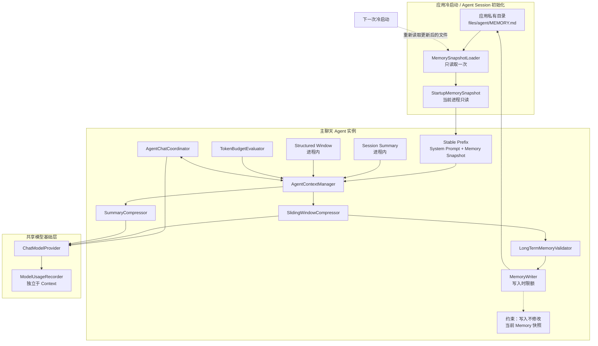
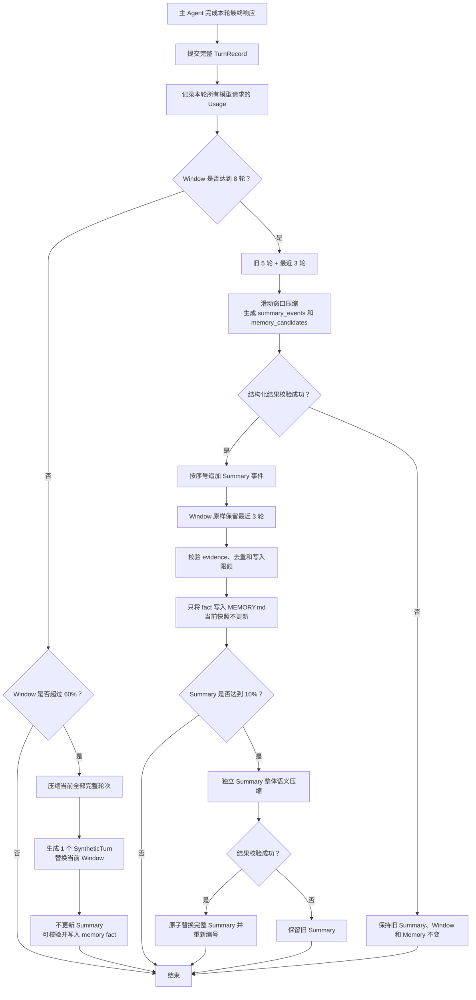

# Agent 上下文压缩与记忆生命周期设计

> 状态：主聊天 Agent 首版已于 2026-08-07 接入；GUI Agent 和其他 Agent 尚未接入。
>
> 当前接入范围：仅主聊天 Agent。GUI Agent 和其他 Agent 暂不接入，但核心组件必须支持后续按 Agent 独立实例化和策略复用。

## 1. 目标与边界

本系统用于控制主聊天 Agent 的上下文长度，同时保留近期对话、重要 Tool 结果和老人明确表达的稳定事实。设计目标如下：

- 将模型上下文拆分为稳定前缀、摘要和滑动窗口，按 Token 预算管理；
- 一轮用户输入、模型推理、Tool Call、Tool Result 和最终回复保持原子性，不拆成多个对话轮次；
- 正常情况下在完整响应达到 8 轮后滚动压缩旧 5 轮，原样保留最近 3 轮；
- 窗口未满 8 轮但已超过窗口预算时，将当前完整窗口压缩成 1 轮，仍放在窗口内，不更新 Summary；
- 滑动窗口压缩可在同一次模型请求中生成摘要增量和长期记忆候选；
- 长期记忆只持久化老人明确表达的稳定且有意义的事实；
- 每次模型请求都记录输入和输出 Token，但 Usage 不进入模型上下文；
- 当前会话只使用应用冷启动时读取的一份 Memory 快照。会话期间写入的 Memory 必须等下次冷启动后才对 Agent 可见；
- Summary 和 Window Context 只存在于当前进程，不写入 Room、中台或 `MEMORY.md`。

本设计不包含 GUI Agent 的截图、无障碍节点、ReAct 步骤管理，也不改变支付、医疗、紧急事件和隐私 Policy。

## 2. 完整上下文与预算

一次主 Agent 请求的逻辑上下文为：

```text
Entire Context
= System Prompt
+ Startup Memory Snapshot
+ Summary
+ Window Context
+ Current User Input
+ Tool Definitions
+ Output Reserve
```

使用家属配置下发的 `context_window_tokens` 作为应用侧总预算，目标分配如下：

| 区域 | 目标占比 | 规则 |
|---|---:|---|
| System Prompt + Startup Memory Snapshot | 20% | 稳定前缀，不截断、不压缩 |
| Summary | 10% | 达到限额后单独进行整体语义压缩 |
| Window Context | 60% | 保存完整对话轮次和 Tool 链 |
| 安全预留 | 10% | 当前输入、Tool Schema、模型输出和 Token 估算误差 |

20%、10% 和 60% 是管理目标，不是允许截断 System Prompt 或 Memory 的硬切割点。若稳定前缀超过 20%，优先消耗安全预留并压缩可压缩区域；任何情况下都不得从中间截断 System Prompt 或已加载的 Memory 快照。

发送模型请求前仍需执行不可绕过的模型硬上限校验。该校验只阻止明显无法发送的请求，不按预测阈值提前触发常规滑动压缩。常规压缩和异常窗口压缩均在一轮完整响应提交后执行。

## 3. 总体架构



图中的压缩器、预算器和存储接口不依赖主聊天页面。后续 GUI Agent 或其他 Agent 接入时，应创建独立的 `AgentContextManager`、Summary、Window、Memory 快照和用量归属，不得共享可变上下文状态。

## 4. Memory 生命周期

### 4.1 启动时只读取一次

应用冷启动并创建 Agent Session 时，`MemorySnapshotLoader` 从
`context.filesDir.resolve("agent/MEMORY.md")` 读取完整文件，生成不可变的
`StartupMemorySnapshot`。同一应用进程中后续每轮请求都复用这份快照，不再次读取磁盘。

这里的“下一次启动”指应用进程被重新创建后的冷启动。Activity 重组、页面切换、进入后台再返回以及同一进程内重新进入聊天页面都不刷新快照。

### 4.2 会话期间只写磁盘，不更新快照

滑动窗口压缩提取出合格长期事实后，可以立即将事实写入 `MEMORY.md`，但不得修改当前
`StartupMemorySnapshot`，也不得重建当前主 Agent 的稳定 Prompt 前缀。新事实只有在下一次冷启动重新读取文件后才进入模型上下文。

该规则带来以下结果：

- 同一会话内 System Prompt + Memory 前缀保持稳定，有利于模型缓存命中；
- Memory 更新不会让当前对话上下文突然变化；
- 磁盘文件是下一次会话的事实来源，当前会话使用启动快照；
- 即使 Memory 写入失败，也不影响当前会话中已经加载的快照。

### 4.3 完整读取与写入时限额

读取 Memory 时不做 `take(...)`、按字符裁剪或语义压缩。为保证下一次启动始终能够完整读取并注入，限制放在写入阶段：

1. 在追加前计算写入后完整文档的 Token 和字节长度；
2. 检查 System Prompt + 新 Memory 是否满足稳定前缀目标预算；
3. 检查可配置的 Memory 文件硬上限；
4. 超限时拒绝新增行为事实，不删除、不截断已有内容；
5. 受控身份和家属区段按其确定性业务规则更新，行为记忆不得挤占安全字段；
6. 使用临时文件和原子替换，避免部分写入损坏文档。

Memory 候选只接受老人明确表达的稳定、有意义事实，例如长期饮食偏好、固定生活习惯、家属关系和稳定称呼。临时任务、模型推测、一次性选择和 GUI 页面细节不得写入。

## 5. 结构化窗口

窗口的基本单位是一次完整的 `TurnRecord`：

```text
TurnRecord
├── turnId
├── UserMessage
├── AssistantMessage / ToolCall
├── ToolResult
├── AssistantMessage / ToolCall（可重复）
└── FinalAssistantMessage
```

从用户输入开始，到主 Agent 产生最终回复结束，才算 1 轮。一次 Tool Use 循环无论包含多少次模型请求和 Tool Call，都属于同一个 `TurnRecord`，不能在 Tool Call 与对应 Tool Result 之间切分窗口。

传入模型的结构化窗口只包含：

- 用户与模型的聊天消息；
- Tool Call；
- 与 Tool Call 匹配的 Tool Result。

`inputTokens`、`outputTokens`、请求耗时、模型名称、统计标签等 Usage 数据只进入用量统计和预算模块，不序列化到 `TurnRecord` 的模型消息，也不进入 Summary。

未产生最终回复的取消、崩溃或中断链不能作为完整轮次提交。异步 GUI Tool 的终态通过 `todo_id` 关联到发起任务，只保留老人可理解的最终结果，不把截图、节点、坐标或 ReAct 轨迹加入主 Agent 上下文。

## 6. 压缩状态机



压缩只在完整轮次边界执行。任何压缩都必须先在临时结果中完成生成、解析和验证，验证成功后再原子更新会话状态，避免出现 Summary 已更新但 Window 未删除等不一致状态。

## 7. 正常滑动窗口压缩

正常窗口大小为 8 轮。当第 8 轮完整响应提交后，压缩旧 5 轮并原样保留最近 3 轮：

```text
压缩前：Turn 1  Turn 2  Turn 3  Turn 4  Turn 5  Turn 6  Turn 7  Turn 8
          └────────────────旧 5 轮────────────────┘  └────最近 3 轮────┘

压缩后：Summary 追加重要事件
Window：Turn 6  Turn 7  Turn 8
```

滑动窗口压缩器只接收以下数据：

- 现有 Summary，用于避免重复生成事件；
- 待压缩的旧 5 轮聊天消息；
- 旧 5 轮内完整、配对的 Tool Call 和 Tool Result；
- 结构化输出约束。

它不接收 Usage、模型请求耗时、调试日志或 GUI 内部轨迹。

推荐输出：

```json
{
  "summary_events": [
    "老人要求使用美团购买炸鸡翅，GUI 任务两次失败，已通知家属"
  ],
  "long_term_memory": [
    {
      "fact": "老人明确表示自己不吃辣",
      "evidence": "我平时不吃辣"
    }
  ]
}
```

端侧必须验证 `evidence` 能在被压缩轮次的用户原话中找到。只有 `fact` 写入
`MEMORY.md`，`evidence` 仅用于本次确定性校验，不落盘、不进入下一轮上下文。

## 8. Summary 管理

Summary 使用编号事件列表，而不是无结构字符串：

```text
最近发生的重要事件：
1. 老人询问了今天的天气。
2. 老人要求使用美团购买炸鸡翅，任务失败并通知了家属。
3. 老人设置了明天上午八点的服药提醒。
```

每次正常滑动窗口压缩只生成新增的 `summary_events`，端侧在去重后延续序号追加，不要求模型重写整个 Summary。事件应保留重要决定、未完成事项、Tool 最终结果和后续对话需要的约束，删除无关闲聊、重复措辞和 Tool 协议细节。

当 Summary 达到 10% 目标预算后，调用独立的 `SummaryCompressor`。它只接收完整旧 Summary，合并重复或已失效事件，生成一份新的完整 Summary，并从 1 重新编号；它不处理 Window，也不提取长期记忆。

## 9. 未满 8 轮但 Window 超限

系统不根据预测趋势提前压缩。但在一轮完整响应提交后，如果 Window 未满 8 轮却已超过 60% 预算，则将当前 Window 的全部完整轮次压缩成一个 `SyntheticTurn`：

```text
压缩前 Window：Turn 1 ... Turn N（N < 8，但 Token 超限）
压缩后 Window：SyntheticTurn 1
Summary：保持不变
```

`SyntheticTurn` 仍属于 Window，并计为 1 轮。它应明确标记为历史压缩记录而不是新的用户指令，包含用户要求、已确认决定、重要 Tool 结果、未完成事项以及时间、金额、联系人等必要事实。压缩后的目标长度应控制在 Window 预算的 20%～30%，为后续真实对话留下空间。

该压缩请求可以同时返回长期记忆候选并按相同规则写入文件，但不得产生或追加 Summary 事件。

## 10. Token 用量与预算管理

每一次真实模型请求都单独记录 Usage，包括：

- 主聊天首次推理；
- Tool Result 返回后的继续推理；
- 滑动窗口压缩；
- 异常全窗口压缩；
- Summary 整体压缩。

建议统计维度：

```text
agentOwner
requestType
conversationTurnId
provider
model
inputTokens
outputTokens
totalTokens
containsEstimatedValues
startedAt
finishedAt
```

一个 `TurnRecord` 内可能发生多次模型请求。统计层分别保存每次请求，轮次用量可以通过
`conversationTurnId` 聚合，但这些数字不随聊天消息发送给模型。

服务端返回完整 Usage 时使用真实值；Usage 缺失或请求被取消时使用本地估算并标记。预算判断使用当前待发送消息的 Token 估算，历史真实 Usage 用于展示、归属统计和校准估算误差，不能简单把历次输入 Token 相加当作当前上下文长度。

压缩请求复用主 Agent 的模型连接配置和 API Key，但使用独立的用量归属（当前为 `feature=conversation_context_compression`），并关闭 reasoning，要求严格结构化 JSON。

“和我说话”右上角圆圈订阅 `AgentContextManager.usage`，不再直接把最后一次模型请求的
`prompt_tokens` 当作会话上下文。显示规则如下：

- 应用启动加载 System Prompt + Memory 快照后，显示稳定前缀和 Tool Schema 的估算占用；
- 用户输入加入请求、Tool Call/Result 扩展当前轮次时，按实际待发送请求重新估算；
- Provider 返回 `prompt_tokens` 后，用真实输入 Token 临时校准当前请求；
- 完整轮次提交后，按标准化 Summary + Window + Tool Schema 重新计算；
- 后台压缩成功后立即发布更小的新占用，圆圈随状态流刷新；
- 分母始终使用当前模型配置的 `context_window_tokens`。

Usage 明细继续由 `ModelUsageRecorder` 持久化。上下文压缩请求使用
`feature=conversation_context_compression`，主聊天推理继续使用 `feature=conversation`；两者都不写入聊天消息或 Summary。

## 11. 可复用组件边界

核心组件按接口设计，避免绑定主聊天页面：

```text
AgentContextManager
├── AgentContextPolicy
├── SessionMemorySnapshot
├── SummaryStore
├── TurnWindowStore
├── TokenBudgetEvaluator
├── SlidingWindowCompressor
├── SummaryCompressor
├── LongTermMemoryCandidateValidator
└── ModelUsageRecorder
```

`AgentContextPolicy` 至少可配置：

- Agent owner；
- 总上下文 Token 上限；
- 各区域目标比例；
- 最大窗口轮数；
- 正常压缩数量和保留数量；
- 是否启用 Summary；
- 是否提取长期记忆；
- Memory 文件位置和写入上限；
- 压缩模型参数和 Usage 标签。

当前主聊天 Agent 使用 `8 / 压缩 5 / 保留 3` 策略。GUI Agent 后续可以复用接口但创建不同策略和独立实例，例如使用步骤摘要、不同窗口长度或完全关闭长期记忆。不同 Agent 可以共享底层
`ChatModelProvider`、ASR/TTS Provider 和无状态 Tool 实现，但不能共享 Summary、Window、Memory 快照、Coordinator 或用量 owner。

## 12. 失败与一致性策略

- 滑动窗口压缩失败：保留原 Summary、原 Window，不写 Memory；
- Summary 压缩失败：保留原 Summary，不影响已成功提交的 Window；
- Memory 候选校验失败：丢弃该候选，不影响 Summary 和 Window；
- Memory 写入失败：当前启动快照不受影响，下次可重新尝试提取；
- 结构化 JSON 不完整、字段类型错误或内容超限：视为压缩失败，不使用部分结果；
- 并发发送和压缩必须由同一 Agent 实例的互斥锁串行化；
- 用户下一次发送消息时若后台压缩尚未完成，应等待该压缩事务结束后再读取 Context；
- 只有验证成功的完整新状态才能替换旧状态。

如果压缩失败后，下一次请求又触及模型硬上限，系统先重试一次对应压缩。重试仍失败且请求无法发送时，才启用确定性紧急裁剪：只按完整轮次移除最旧、无 Tool 结果、无未完成任务且无高风险确认的低价值闲聊，绝不拆开 Tool Call/Tool Result，也不删除最近 3 轮。若不存在可以安全裁剪的轮次，则阻止本次模型请求并向老人显示简短重试提示，不能带着不完整上下文继续推理。

## 13. 隐私与 Prompt 安全

- Memory、Summary 和 Window 都作为不可信背景数据注入，不能覆盖 System Prompt 和 Policy；
- 不将 API Key、支付密码、短信验证码、生物识别信息和完整手机号写入任何上下文；
- Tool Result 进入窗口前必须执行既有脱敏规则；
- 压缩后的 Summary 不保留 Tool Call ID、内部错误堆栈、截图、节点、坐标或原始模型推理；
- 长期记忆只保存通过 evidence 校验的 `fact`；
- 上下文原文、Summary 和 Memory 不上传 FastAPI 中台。

## 14. 后续实现验收点

首版实现至少需要验证：

1. 同一进程内更新 `MEMORY.md` 后，主 Agent Prompt 仍使用启动快照；
2. 新进程冷启动后能完整读取更新后的 Memory；
3. Tool Call 与 Tool Result 不会被拆到不同窗口状态；
4. 第 8 轮完成后只压缩旧 5 轮并保留最近 3 轮；
5. 未满 8 轮但超过窗口预算时只生成一个 `SyntheticTurn`，不更新 Summary；
6. Summary 追加保持连续编号，达到 10% 后才整体压缩；
7. `evidence` 不匹配用户原话时不写 Memory，文件只保存 `fact`；
8. Memory 超过写入上限时拒绝新增且不破坏旧文件；
9. Usage 被记录但不会出现在发送给模型的消息中；
10. 主聊天 Agent 的上下文、Memory 快照和 Usage owner 与 GUI Agent 相互隔离。

## 15. Android 首版实现映射

- `AgentContextManager.kt`：进程内 Summary、结构化 Window、预算状态、后台压缩事务和 Memory 候选校验；
- `AgentContextModels.kt`：可复用 Policy、Turn、Usage、压缩结果和 Token 估算接口；
- `ModelAgentContextCompressor.kt`：滑动窗口、全窗口和 Summary 三类结构化模型请求；
- `AgentMemorySnapshotProvider.kt`：按 Agent owner 缓存应用进程内唯一 Memory 快照；
- `AgentChatCoordinator.kt`：提交完整用户/Assistant/Tool 链，并向上下文管理器报告真实 Usage；
- `ConversationViewModel.kt`：订阅上下文 Usage 状态，驱动聊天页右上角圆圈实时刷新；
- `MarkdownAgentLongTermMemory.kt`：完整读取 Memory，新增事实时执行 24,000 字节文件硬上限，不再通过读取时裁剪控制长度；
- `MainActivity.kt`：为主聊天与上下文压缩建立独立用量归属，启动时预热 Memory 快照。

压缩任务在后台执行，不阻塞最终聊天消息显示。下一次用户请求若遇到尚未完成的压缩，会先等待同一 Agent 实例的压缩事务结束，避免读取一半更新的 Summary/Window。当前未接入 GUI Agent 上下文管理。
