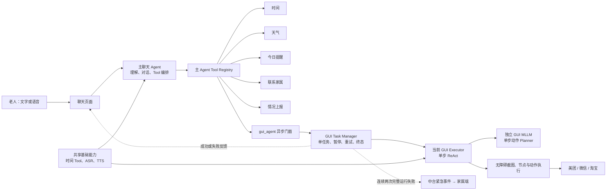
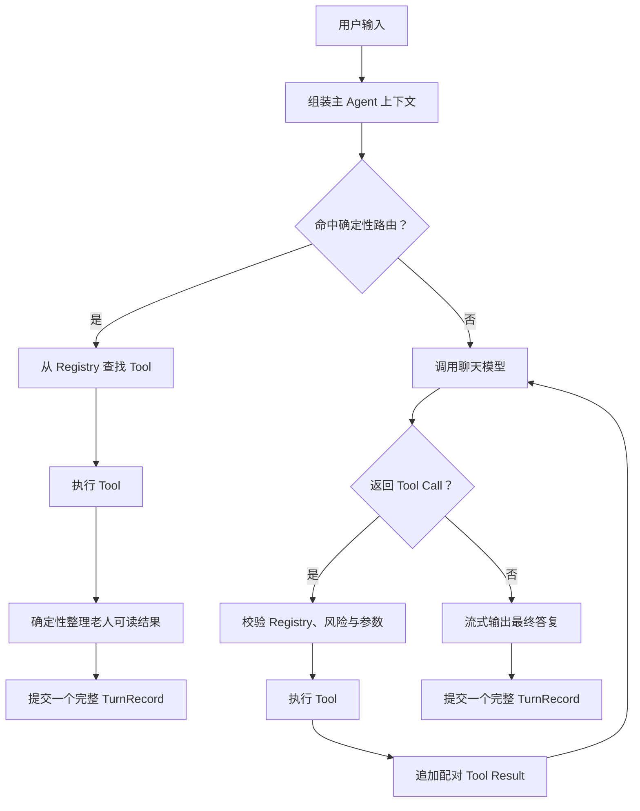
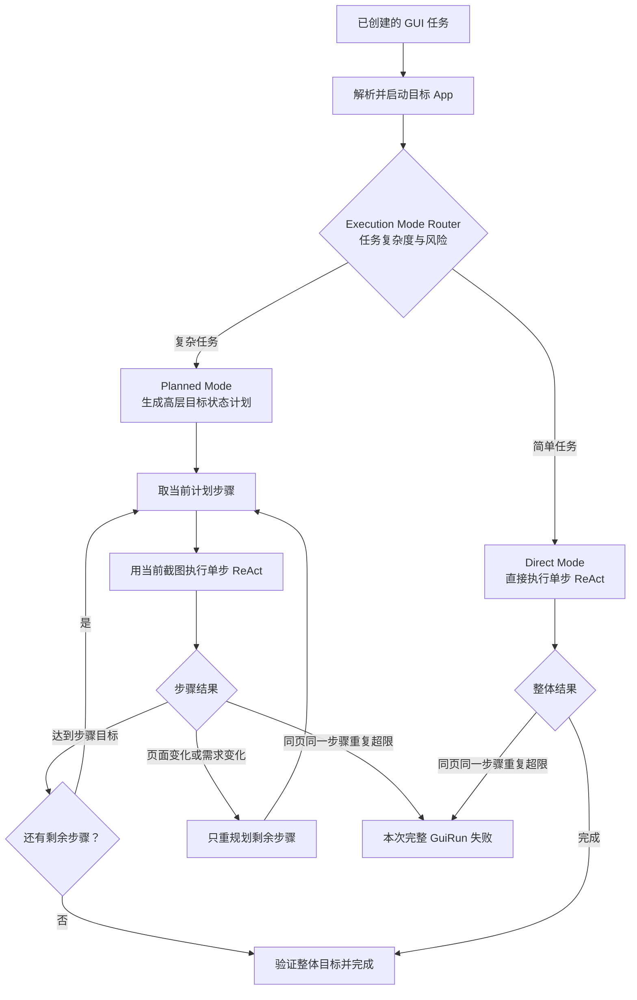
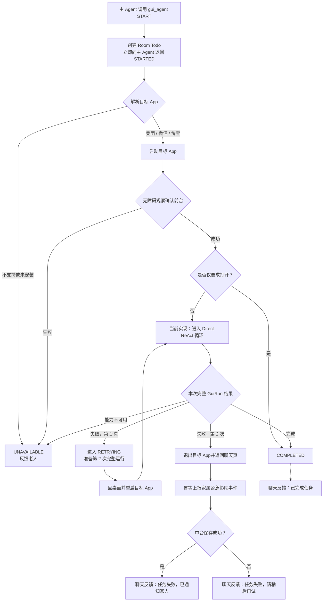
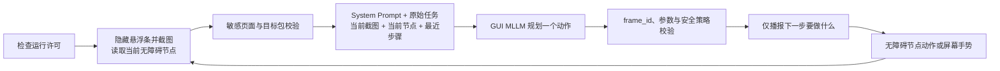
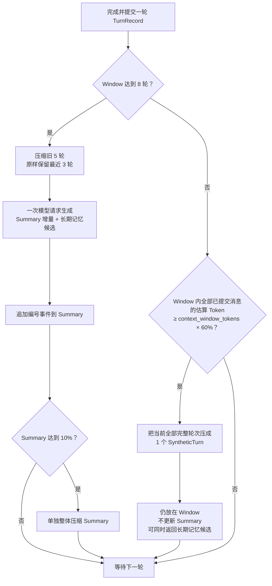

# 主聊天 Agent 与 GUI Agent 设计说明

> 文档状态：按 2026-09-02 仓库代码整理，并补充已经确认但尚未编码的 GUI Planned Mode 目标设计。
>
> 文中使用“**已实现**”和“**设计预留**”区分当前代码与后续架构，避免把目标设计误认为已经可以运行。规划中但尚未注册的 Tool 不作为现有能力。

## 1. 设计目标与角色划分

银龄助手采用“主 Agent 负责理解和协调，GUI Agent 负责受控操作”的双 Agent 结构：

- **主聊天 Agent** 是老人主要交互入口，负责自然语言对话、选择和调用业务 Tool、维护聊天上下文与长期记忆，以及向老人解释结果；
- **GUI Agent** 是主 Agent 的一个异步 Agent Tool，负责在美团、微信、淘宝等第三方 Android App 中观察页面并执行单步操作；
- **Android 确定性控制层** 管理权限、暂停、取消、订单确认、支付隔离、失败重试和家属上报。模型只能提出动作，不能绕过控制层直接操作手机；
- **底层 Provider** 可以复用，例如时间 Tool、ASR、TTS 和模型配置，但每个 Agent 的提示词、上下文、状态和用量归属保持独立。



这不是两个 Agent 自由互相聊天的结构。主 Agent 只能通过强类型 `gui_agent` Tool 创建或控制 GUI 任务；GUI Agent 通过任务状态和终态反馈回到聊天侧，不读取主 Agent 的完整对话。

## 2. 主聊天 Agent

### 2.1 工作模式

主聊天 Agent 由 `AgentChatCoordinator` 编排，单轮处理分为两条路径。

#### 路径 A：确定性 Tool 路由

对必须先获取真实结果、且意图足够明确的请求，在调用聊天模型前由 Kotlin 规则直接路由：

- 明确要求操作美团、微信或淘宝时，路由到 `gui_agent START`；
- 询问“今天还有什么事没做”等今日提醒问题时，路由到 `list_today_reminders`。

确定性路由仍然经过同一个 `AgentToolRegistry` 和 Tool 执行策略，不会绕过权限。这样可以避免模型在尚未打开 App 时提前追问页面信息，也避免模型根据旧对话猜测实时提醒。

#### 路径 B：模型 Tool Use 循环

其他请求进入标准的“模型 → Tool → 模型”循环：

1. 上下文管理器组装 System Prompt、启动时长期记忆快照、Summary、Window Context 和当前用户输入；
2. 模型返回自然语言或一个/多个 Tool Call；
3. Tool Call 只能在已注册 Registry 中解析和执行；
4. Tool Result 以配对消息返回模型，由模型生成面向老人的最终答复；
5. 一次用户输入、全部 Tool Call/Result 和最终答复共同提交为一个完整对话轮次。

单轮最多允许 3 次“模型 → Tool”递归，防止异常模型持续调用工具耗尽 Token。这里的限制只针对主聊天 Agent 的单轮 Tool 循环，与 GUI Agent 的页面操作步数无关。



### 2.2 主 Agent Tools

当前主聊天 Agent 注册以下 Tool：

| Tool | 风险与执行方式 | 作用与边界 |
|---|---|---|
| `get_current_time` | 低风险，立即执行 | 返回设备本地日期、星期、时间和时区。无参数。 |
| `get_weather` | 低风险，立即执行 | 通过设备粗略位置查询实时天气及未来三天；经纬度不交给模型。 |
| `list_today_reminders` | 低风险，立即执行 | 只读本机 Room 中的提醒状态；不能创建提醒，也不能代替老人确认完成。 |
| `call_family_contact` | 中风险，准备后由老人确认 | 根据家属称呼或关系匹配本机加密联系人，先显示拨号确认；手机号不进入模型上下文。 |
| `report_family_situation` | 中风险，本地策略后执行；条件注册 | 向中台提交身体不适、家庭请求等结构化事件。事件时间、严重级别和幂等 ID 由端侧确定。 |
| `gui_agent` | 中风险，本地策略后执行 | 异步创建、查询、暂停、继续或取消 GUI 任务；不等待 GUI 任务完成。 |

`report_family_situation` 只有在中台 Reporter 可用时才注册。GUI 连续失败事件不能由聊天模型伪造，只能由 GUI 任务管理器通过确定性链路生成。

当前尚未注册创建/修改/取消提醒、新闻摘要、独立商品搜索、订单提交、金额审批、SOS 和 RAG Tool。System Prompt 中若仍存在相关泛化能力描述，实际执行范围仍以 Registry 为准。

### 2.3 Tool 的统一约束

每个 `AgentTool` 都包含：

- 强类型 JSON Schema；
- `Low / Medium / High` 风险级别；
- `Immediate`、`ImmediateAfterLocalPolicy` 或 `PrepareForUserConfirmation` 执行策略；
- 面向 UI 的简短运行提示；
- 结构化 JSON 结果。

只有 Tool 明确返回成功后，主 Agent 才能声称操作成功。Registry 不存在、参数错误、权限不足或结果失败时，必须如实反馈，不能用自然语言假装完成。

## 3. GUI Agent

### 3.1 与主 Agent 的关系

`gui_agent` 是主 Agent 看见的异步门面，支持以下动作：

| Action | 含义 |
|---|---|
| `START` | 创建新的 GUI Todo，参数 `task_content` 保留老人完整目标。 |
| `STATUS` | 查询当前任务阶段和完整运行次数。 |
| `PAUSE` | 由主 Agent 请求暂停当前任务。 |
| `RESUME` | 恢复当前任务。 |
| `CANCEL` | 取消当前任务。 |

`STARTED` 只表示 Todo 已创建，不能解释为 App 已打开、页面已点击、订单已提交或付款已开始。Tool 立即返回，因此 GUI Agent 在后台运行时，主聊天 Agent 仍可继续对话。

同一设备同时只允许一个非终态 GUI 任务。屏幕是独占资源，新的 `START` 在已有任务执行时返回 `BUSY`。

### 3.2 任务状态与持久化边界

GUI Todo 使用 Room 持久化以下最小信息：

- `id` 和任务原文；
- `RUNNING / PAUSED / INTERRUPTED / COMPLETED / FAILED / CANCELLED / ESCALATED` 状态；
- 完整运行失败次数；
- 创建和更新时间；
- 家属协助事件 ID。

Todo 不保存商品候选、地址、页面节点、截图、坐标、ReAct 历史、订单号或支付信息。App 进程退出后，遗留运行态在下次启动时转为 `INTERRUPTED`，用于提醒老人重新开始；当前不恢复旧 GUI Run。

### 3.3 执行策略路由与 Planned Mode

GUI Agent 的目标架构采用混合规划：简单任务使用 Direct ReAct，复杂任务先生成高层计划，再逐个计划步骤执行 ReAct。这里必须区分三个容易混淆的概念：

- `GuiMainAgentToolRouter` 是**主 Agent 到 `gui_agent` Tool 的路由器**，判断一句话是否应启动 GUI 任务；
- `OpenAiGuiVisionPlanner` 是**当前每一轮 ReAct 的单步动作 Planner**，根据一张截图返回一个 Action；
- `GUI Execution Mode Router + Planned Mode` 是**GUI Agent 内部的任务复杂度路由和高层规划**，属于已确认的目标设计，但当前代码尚未实现。

#### 3.3.1 目标路由规则

计划增加 GUI 内部 `ExecutionModeRouter`，在目标 App 解析后、进入执行器之前选择模式：

| 模式 | 适用任务 | 工作方式 | 当前状态 |
|---|---|---|---|
| Direct Mode | 纯打开、点击一个明确入口、在当前页面完成的低复杂度任务 | 不生成高层计划，直接进入截图驱动的单步 ReAct | **已实现实际路径**；纯打开还会在前台验证后直接完成 |
| Planned Mode | 外卖下单、网购、多页面搜索和筛选等需要多个目标状态的任务 | 先生成不含坐标的高层计划，再让每个计划步骤进入单步 ReAct | **设计预留，尚未编码** |

路由应优先使用可解释的确定性规则，例如目标动词、是否包含选购/搜索/下单、预计页面阶段和风险；只有规则无法判断时才考虑让模型分类。路由结果必须可记录、可测试，不能仅依赖模型自由决定。

路由结果不是不可变标签。目标设计允许在同一个 GuiRun 内受控切换：

- Direct Mode 执行中，如果老人通过 ASR 把简单任务扩展为多页面目标，或当前页面表明还存在多个必须排序的业务阶段，则升级为 Planned Mode；
- Planned Mode 每个高层步骤内部仍调用 Direct ReAct 执行，不存在另一套可以绕过安全门的动作执行器；
- 重规划后若只剩一个清晰目标状态，可以继续使用同一单步 ReAct 完成，无需为了形式再生成完整计划；
- 模式切换必须增加 Plan `revision`、保留已验证完成的状态，并清除已不适用于新需求的重复步骤计数；不能用切换模式规避同一无进展动作的 5 次限制。

示例：

- “打开美团”属于 Direct Mode，验证美团已在前台即可完成；
- “打开美团并点击外卖”可使用 Direct Mode，在当前观察中逐步完成有限目标；
- “打开美团并下单一份炸鸡翅”应进入 Planned Mode，因为包含入口、搜索、选品、规格、购物车、订单确认和付款交接等多个状态。



Planned Mode 的高层计划只描述目标状态，例如“进入外卖页”“搜索炸鸡翅”“确认候选商品”“进入订单确认页”，不得提前保存页面坐标或节点 ID。真正执行每个计划步骤时仍必须重新截图、重新定位、一次只做一个动作。页面状态或老人需求变化时只重规划尚未完成的部分，而不是沿用过期计划，也不重复已经确认完成的步骤。

建议的进程内计划结构如下，供后续编码时保持接口稳定：

```text
GuiExecutionPlan
├── taskGoal                 原始任务目标
├── mode                     DIRECT / PLANNED
├── revision                 每次重规划递增
├── currentStepId
└── steps[]
    ├── stepId
    ├── targetState          要达到的页面/业务状态，不含坐标
    ├── completionEvidence   必须从新观察中看到的完成证据
    └── status               PENDING / RUNNING / COMPLETED / REPLAN_REQUIRED
```

高层 Plan 应与截图和节点一样只存在于当前 GuiRun，不写入 Room Todo、主聊天上下文或长期记忆。重新规划时输入原始任务、已完成步骤、当前观察和老人最新补充，只允许替换当前及剩余步骤；已经完成且仍有证据的步骤不可被无故回退。

当前运行时代码没有 `GuiExecutionMode`、复杂度 Router、高层 Plan 数据模型或剩余步骤重规划器，因此所有非纯打开任务实际上都走 Direct ReAct。本文保留 Planned Mode 是为了说明确定的演进方向，不代表当前 APK 已经具备该模式。

### 3.4 完整任务执行流程



一次 Todo 最多自动进行两次**完整 GuiRun**。第一次完整失败后不要求老人再次确认，任务先进入 `RETRYING`，然后回到桌面、清理目标 App 任务栈并重新启动。架构已经预留 `GuiTaskNoticeSink` 用于语音或弹窗告知老人，但当前 `MainActivity` 没有注入真实实现，实际使用默认 `NoOpGuiTaskNoticeSink`；悬浮条可以显示“正在开始第二次尝试”的阶段文字，但独立语音/弹窗告知尚未闭环。第二次完整失败后，端侧退出目标 App、返回银龄助手聊天页面，并使用 Todo ID 作为幂等键向家属上报协助事件。

### 3.5 截图驱动 ReAct

非纯打开任务由 `AccessibilityGuiRunExecutor` 执行持续的观察—规划—动作循环：



关键规则如下：

1. 每个真实动作前都重新取得当前页面观察，旧 `frame_id`、旧节点和旧坐标不可复用；
2. 截图默认最长边限制为 1280 像素、总像素不超过 1,200,000，并以 JPEG 发送，减少视觉 Token 和网络体积；
3. 截图时悬浮控制条会暂时隐藏，避免遮挡目标 App；
4. 默认采用 `HYBRID_NODE_FIRST`：优先无障碍节点，节点不可靠时使用当前截图坐标；纯坐标模式只作为 Debug 实验；
5. 模型坐标使用上传图像中的 `0..1000` 归一化空间，端侧根据截图裁剪、缩放、旋转和真实屏幕尺寸反向映射；
6. 每次只执行一个动作，随后必须通过新截图验证页面变化；“动作接口返回成功”不等于任务完成；
7. 非纯打开任务至少执行过一个真实设备动作，并在动作后的新截图中看到符合原目标的结果，才接受 `complete`。

GUI ReAct **没有固定总步数上限**。执行器用“页面指纹 + 步骤指纹”识别无进展循环。这里的准确含义是：

1. 一轮 ReAct 只让模型提出一个动作，然后重新观察；
2. 对相同的“页面指纹 + 步骤指纹”，第 1—5 次允许继续尝试；
3. 准备进行第 6 次相同尝试时，判定本次完整 GuiRun 失败；
4. 页面发生有效变化或模型采取不同动作时，不增加原步骤的重复计数；
5. 之后若重新回到同一页面并重复同一步骤，原计数仍会继续，用于识别页面之间来回循环；
6. 老人通过 ASR 补充新需求后清空重复步骤计数，因为任务约束已经改变。

“最多 5 次”不是整个任务只能执行 5 个动作，也不是每个高层 Plan 最多包含 5 步。一个持续产生页面进展的任务可以执行超过 5 个、10 个甚至更多动作；只有同一页面上的同一步骤连续或回环累计超过允许次数，才算一次完整运行失败。

当前各层限制如下：

| 层级 | 当前限制 | 超限结果 |
|---|---:|---|
| 主 Agent 单轮模型/Tool 循环 | 最多 3 轮模型请求 | 返回 Tool 循环过长错误，不等于 GUI 运行失败 |
| GUI ReAct 总动作数 | 无固定上限 | 只要页面持续进展就继续 |
| 相同页面 + 相同步骤 | 允许 5 次，第 6 次拒绝 | 当前完整 GuiRun 记为失败 |
| GUI 本地步骤历史 | 只保留最近 8 条给下一次 MLLM | 旧记录移出 Prompt，不代表失败计数被清空 |
| 单个 GUI Todo 的完整 GuiRun | 最多 2 次 | 第 1 次失败自动重启；第 2 次失败进入终态并尝试通知家属 |

Planner 请求异常会以固定的 `planner_error` 步骤指纹参与同一页面的重复统计；模型返回相同 `fail` 也不会立刻结束，而是继续观察，直到同页同一步骤达到上述阈值。重复计数与只保留 8 条的模型短期历史相互独立。

页面指纹由目标包名、窗口标题，以及最多 120 个有意义节点的文字、内容描述、View ID、控件类型、24 像素位置分桶和可点击/可编辑/可滚动属性共同生成。步骤指纹根据动作类型及其语义目标生成：节点点击使用节点文字/描述/View ID，坐标点击使用 25 个归一化单位的坐标分桶，输入使用文本哈希，滚动使用方向，等待、询问、完成和失败使用其简短原因。执行器最多跟踪 64 个不同的“页面 + 步骤”组合，超出后移除最早记录，防止长任务中的守卫状态无限增长。

### 3.6 GUI Planner Actions

GUI MLLM 每次只能返回一个受协议约束的动作：

| Action | 说明 |
|---|---|
| `click_node` | 点击当前帧的无障碍节点；节点失效时可进行受限语义重匹配。 |
| `click_point` | 点击当前上传截图中的归一化坐标。 |
| `input_text` | 向当前帧指定的普通输入节点输入文本。 |
| `input_text_focused` | 纯坐标实验中，向上一步已聚焦的普通输入框输入。 |
| `scroll` | 在当前页面向前或向后滚动。 |
| `back` | 执行系统返回。 |
| `wait` | 等待 250—3000 毫秒，再重新观察。 |
| `ask_elder` | 当前页面出现必要歧义或订单提交前，暂停并询问老人一个问题。 |
| `ready_for_payment` | 停止自动化，把付款交给老人亲自完成。 |
| `use_tool` | 调用 GUI Agent Registry 中的共享 Tool；当前只有 `get_current_time`。 |
| `complete` | 基于当前新截图给出完成证据。 |
| `fail` | 如实说明当前步骤无法继续；执行器仍会结合重复步骤阈值决定是否结束 GuiRun。 |

这些 Action 是 GUI 内部协议，不属于主聊天 Agent Tool Registry，也不能被其他 Agent 直接调用。

### 3.7 人工控制、语音和支付门

无障碍服务在第三方 App 上方显示顶部控制条：

- 任务运行时显示“暂停”；
- 老人手动触摸导致暂停后显示“继续”；
- 离开目标 App 后显示“返回任务”；
- 等待订单确认时显示“确认并继续”；
- 到达支付交接时显示“付款完成后继续”；
- “取消”需要二次确认；
- 全局语音开关开启时提供“按住说话”，关闭时 GUI Agent 不能录音或播报。

暂停、取消和人工接管优先于模型动作。执行器会在观察、模型规划和每个真实动作前检查运行许可。目标 App 内正常 Activity 或 WebView 跳转不会自动暂停；只有持续离开目标包或检测到真实人工操作才暂停。

语音输入只作为当前 GuiRun 的临时补充，例如老人更改商品要求。ASR 文本进入最近步骤历史，不写入 Todo、主聊天上下文或长期记忆。普通 GUI 步骤只播报“下一步需要做什么”，商品/订单确认和付款交接才播报已从当前页面确认的详细信息。

提交订单前必须获得一次性的 `ORDER_SUBMISSION` 老人确认授权。支付密码、银行卡密码、短信验证码和生物识别永远由老人亲自完成；检测到收银台或安全验证页面后，在截图上传模型之前就进入人工付款等待状态。

## 4. 两个 Agent 的共享与隔离

| 能力或状态 | 主聊天 Agent | GUI Agent | 是否共享 |
|---|---|---|---|
| System Prompt | 主聊天专用 | GUI 操作专用 | 否 |
| Tool Registry | 6 类业务 Tool，部分条件注册 | 当前仅时间 Tool | 否 |
| `get_current_time` 实例 | 使用 | 使用 | 是，无状态实例 |
| ASR/TTS Provider | 聊天录音与答复播报 | 悬浮条录音与步骤播报 | 是，统一协调和全局开关 |
| 模型配置/API Key | 通过同一安全配置层读取 | 通过同一安全配置层读取 | 底层复用 |
| 对话 Window / Summary | 使用 | 不使用 | 否 |
| `MEMORY.md` 快照 | 使用 | 当前不读取 | 否 |
| 临时步骤历史 | 不使用 | 最近 8 个 GUI 步骤 | 否 |
| GUI 高层 Plan | 不持有 | 目标设计由 GUI 独立持有 | 当前尚未实现 |
| 模型用量归属 | `conversation` | `gui_agent` | 分开统计 |
| 上下文压缩用量 | `conversation_context_compression` | 尚未接入压缩 | 分开统计 |
| GUI Todo | 通过 Tool 创建和控制 | Task Manager 持有 | 以 Todo ID 关联 |

共享的是可复用的基础能力，不是 Agent 身份或记忆。后续若给 GUI Agent 接入上下文管理，应创建独立的 `AgentContextManager`、Summary、Window、Memory 策略和用量标签，不能复用主 Agent 的可变实例。

## 5. 上下文与记忆

### 5.1 主 Agent 上下文组成

主 Agent 真正发送给模型的 Prompt 由以下部分组成：

```text
Prompt Tokens
= System Prompt
+ Startup MEMORY.md Snapshot
+ Summary
+ Window Context
+ Current User Input
+ Tool Definitions
```

模型窗口还必须为输出预留空间，因此发送前的硬校验是：

```text
estimated_prompt_tokens + max_output_tokens <= context_window_tokens
```

`max_output_tokens` 是预算预留，不是实际放入 Prompt 的消息。

默认按模型的 `context_window_tokens` 管理预算：

| 区域 | 目标占比 | 处理方式 |
|---|---:|---|
| System Prompt + 启动 Memory 快照 | 20% | 稳定前缀，不截断、不压缩 |
| Summary | 10% | 达到限额后单独整体语义压缩 |
| Window Context | 60% | Window 内全部已提交消息 Token 的压缩触发阈值 |
| 安全预留 | 10% | 当前输入、Tool Schema、模型输出和估算误差 |

这些百分比是管理目标，不是把整个 Prompt 按字符直接切成四段，也不是允许截断稳定前缀的硬边界。System Prompt 和启动 Memory 快照即使超过目标比例也保持完整；当前允许执行语义压缩的区域只有 Summary 和 Window。发送前仍会检查已组装 Prompt 加最大输出是否超过模型硬上限。

### 5.2 对话轮次与压缩

一个 `TurnRecord` 从用户输入开始，以最终 Assistant 回复结束，中间可以包含多次 Assistant Tool Call 和对应 Tool Result。一次 Tool Call 不能被拆成单独轮次。



图中的 60% 判断不是“Window 填了六成轮数”，也不是“整个 Prompt 使用率达到 60%”。设模型配置的上下文容量为 `C = context_window_tokens`，当前 Window 内所有已提交 `TurnRecord.messages` 的 Token 估算总数为 `W`，则提前压缩条件为：

```text
turn_count < 8  且  W >= floor(C × 0.60)
```

`W` 包含 Window 内的 User、Assistant、Tool Call 和配对 Tool Result 消息，但不包含 System Prompt、启动 Memory 快照、Summary、Tool Definitions、Usage 统计或输出预留。该判断使用端侧 `HeuristicAgentContextTokenEstimator` 的估算值，不使用服务端上一次返回的整包 `prompt_tokens`，因为后者还混有 Window 以外的内容。

当前估算器把每个非 ASCII 字符按约 1 Token 权重、ASCII 字符按约 0.25 Token 权重计算，并按字段向上取整；每条消息额外计 4 Token，每个 Tool Call 或 Tool Definition 额外计 8 Token。这是用于稳定触发本地预算策略的近似值，不等同于特定模型 Tokenizer 的精确结果。

判断发生在一轮完整响应提交之后。代码先判断轮数：如果已经达到 8 轮，无论 Token 是否达到 60%，都优先执行“压缩旧 5 轮、保留最近 3 轮”；只有轮数少于 8 时，才检查上述 `W >= 60% × C` 条件并把当前全部 Window 压缩成一个 SyntheticTurn。

压缩在完整轮次提交后异步执行；下一次请求会等待尚未完成的压缩，防止上下文状态竞争。压缩失败时保持原 Summary、Window 和 Memory 不变，不删除原对话。

每次模型请求的输入/输出 Token 会进入独立用量统计，但 Usage 不序列化到聊天上下文。聊天页右上角圆圈显示 `usedTokens / context_window_tokens`：请求组装、轮次提交和压缩完成后使用本地估算；当前模型请求返回 `prompt_tokens` 时会临时用实际 Prompt Token 校准。圆圈的数值包含稳定 System/Memory、Summary、Window、当前输入和 Tool Definitions 中当时实际组装的部分，因此它不是单独的 Window 使用率，也不包含输出预留。

### 5.3 长期记忆生命周期

长期记忆位于应用私有目录：

```text
context.filesDir/agent/MEMORY.md
```

文件包含老人基本信息、已绑定家属提示和经过确认的长期事实。完整手机号仍只保存在 Keystore 加密联系人快照中，不写入 `MEMORY.md`。

主 Agent 在 Android 进程冷启动时完整读取一次 `MEMORY.md`，生成不可变启动快照。同一进程内页面切换、Activity 重组或重新进入聊天页都不会重新读取。会话期间可以把新的稳定事实写入文件，但当前 Agent 的 Prompt 不刷新；新内容要到下一次进程冷启动才进入模型上下文，以保持稳定前缀和缓存命中。

长期记忆有两类写入来源：绑定和联系人同步等确定性业务流程负责更新老人/家属受控区段；滑动窗口压缩或整窗压缩负责提取老人明确表达、稳定且有意义的行为事实。压缩器返回的候选形如：

```json
{
  "fact": "老人平时不吃辣",
  "evidence": "我平时不吃辣"
}
```

端侧要求 `evidence` 能在待压缩轮次的用户原话中找到，并过滤敏感信息、重复内容和超限文本。最终只把 `fact` 写入文件，`evidence` 不持久化。文件当前限制单条最长 300 字、最多 100 条、总大小不超过 24,000 字节，并采用临时文件替换降低写入中断风险。

### 5.4 GUI Agent 当前上下文

GUI Agent 尚未接入主 Agent 的上下文压缩系统。每一步 MLLM 请求只包含：

- GUI 专用 System Prompt 和 Action 协议；
- 老人原始 GUI 任务；
- 当前完整截图和 `frame_id`；
- 当前目标包、窗口标题和上传图像尺寸；
- 混合定位模式下的当前无障碍节点；
- 当前 GuiRun 最近 8 个步骤及结果；
- GUI Registry 中允许使用的共享 Tool 定义。

截图、节点和步骤历史只在当前进程、当前 GuiRun 内存在，不进入 `MEMORY.md`、主聊天 Window、Room 或中台。每一步均重新发送独立的当前观察，不把主 Agent 的对话历史交给 GUI MLLM。

## 6. 结果反馈与异步一致性

主 Agent 启动 GUI 任务后只回答“已经开始处理”。GUI Task Manager 在后台产生终态后，通过进程内 `GuiTaskChatFeedbackBus` 向聊天页面追加确定性反馈：

- 成功：`已完成任务。`
- 两次失败且家属事件成功：`任务失败，已通知家人。`
- 失败但家属事件未成功：`任务失败，请稍后再试。`

终态反馈在当前进程内使用 `todo_id` 去重，并通过 `recordExternalToolOutcome` 尝试追加到最初包含该 Todo ID 的主 Agent TurnRecord。只有该发起轮仍保留在当前 Window 时才能成功关联；如果它已经被压缩移出 Window，聊天 UI 仍会显示终态反馈，但当前实现不会回写已经生成的 Summary。这里仅记录老人可理解的最终结果，不记录 GUI 截图、节点、坐标或内部 ReAct 轨迹。

`GuiTaskChatFeedbackBus` 也是进程内通道，不是可靠消息队列。若应用进程退出，未结束的 GUI Todo 会在下次启动转为 `INTERRUPTED` 并用于重新开始提醒，但不会恢复旧进程中尚未投递的聊天反馈或 GUI 页面状态。

## 7. 安全与可信输出原则

整个双 Agent 系统遵循以下边界：

1. 模型负责建议，Kotlin 控制层负责授权和执行；
2. 当前截图和 Tool Result 是操作状态的事实来源，不能用语言补全未知状态；
3. Tool `STARTED`、Intent 已发送、点击 API 返回成功都不是业务任务完成证据；
4. 暂停、取消、人工接管和敏感页面拦截优先于任何模型动作；
5. 订单提交前必须由老人确认，付款和安全凭证永远不能自动化；
6. API Key、手机号、验证码、支付信息、截图和完整聊天原文不得上传中台或写入调试持久化；
7. GUI 连续两次完整运行失败的家属上报由确定性状态机触发，模型不能伪造或抑制；
8. 面向老人的输出应短、明确，只陈述已经获得证据的状态。

## 8. 当前实现边界

- GUI Agent 当前只解析美团、微信和淘宝；其他 App 返回不可用；
- GUI 内部的 Direct/Planned 复杂度 Router 和高层 Planned Mode 尚未编码；当前纯打开任务直接验证完成，其他任务统一使用单步 Direct ReAct；
- 第二次完整运行前的独立语音/弹窗通知只定义了 `GuiTaskNoticeSink` 接口，正式装配当前仍使用 No-Op；
- GUI 截图依赖 Android 11（API 30）及以上的无障碍截图能力，Android 10 兼容截图路径尚未补齐；
- 真实第三方 App 页面变化频繁，当前已经具备完整观察、动作和安全链路，但外卖/网购全流程成功率仍需持续真机优化；
- GUI Agent 不恢复进程退出前的页面执行状态，只保留 Todo 内容用于下次启动提醒；
- 主 Agent 的 Summary 和 Window Context 只在进程内保存，暂不恢复跨进程聊天历史；
- `list_today_reminders` 当前输出 `local_deadline_time`，确定性结果展示器读取 `local_time`，因此“今天还有什么没做”的回复可能缺少提醒时间；
- 长期记忆仍是受控 Markdown，尚未升级为可供老人查看、修改和删除的结构化记忆管理系统；
- GUI Agent 当前没有长期记忆和摘要压缩，后续接入时必须独立实例化。

## 9. 主要代码索引

| 模块 | 主要实现 |
|---|---|
| 主 Agent 编排 | `domain/agent/AgentChatCoordinator.kt` |
| Tool 接口与 Registry | `domain/agent/AgentTools.kt` |
| Tool 共享能力目录 | `domain/agent/AgentToolCatalog.kt` |
| 主 Agent System Prompt | `domain/agent/SystemPromptProvider.kt` |
| 主 Agent 上下文 | `domain/agent/AgentContextManager.kt`、`AgentContextModels.kt` |
| 上下文压缩模型 | `domain/agent/ModelAgentContextCompressor.kt` |
| 长期记忆 | `data/memory/MarkdownAgentLongTermMemory.kt` |
| GUI Agent Tool | `domain/gui/GuiAgentTool.kt` |
| GUI 任务管理 | `domain/gui/GuiTaskManager.kt`、`GuiTaskRuntime.kt` |
| GUI System Prompt | `domain/gui/GuiAgentSystemPromptProvider.kt` |
| GUI Execution Mode Router / 高层 Plan | 设计预留，当前无对应实现文件 |
| GUI ReAct 执行器 | `platform/gui/AccessibilityGuiRunExecutor.kt` |
| GUI 视觉 Planner | `data/gui/OpenAiGuiVisionPlanner.kt` |
| 无障碍截图与动作 | `service/GuiAccessibilityControlService.kt` |
| GUI 终态聊天反馈 | `domain/gui/GuiTaskChatFeedback.kt` |
| Android 装配入口 | `MainActivity.kt` |

相关专题文档：

- [`agent-tools-and-capabilities.md`](agent-tools-and-capabilities.md)：Tool 与 Action 的当前清单；
- [`context-compression-design.md`](context-compression-design.md)：上下文预算、压缩事务和 Memory 生命周期；
- [`elder-agent-design.md`](elder-agent-design.md)：老人端 Agent 总体设计；
- [`voice-interaction-design.md`](voice-interaction-design.md)：ASR/TTS 与全局语音控制；
- [`agent-development-status-2026-08-11.md`](agent-development-status-2026-08-11.md)：当前完成度与待办。
